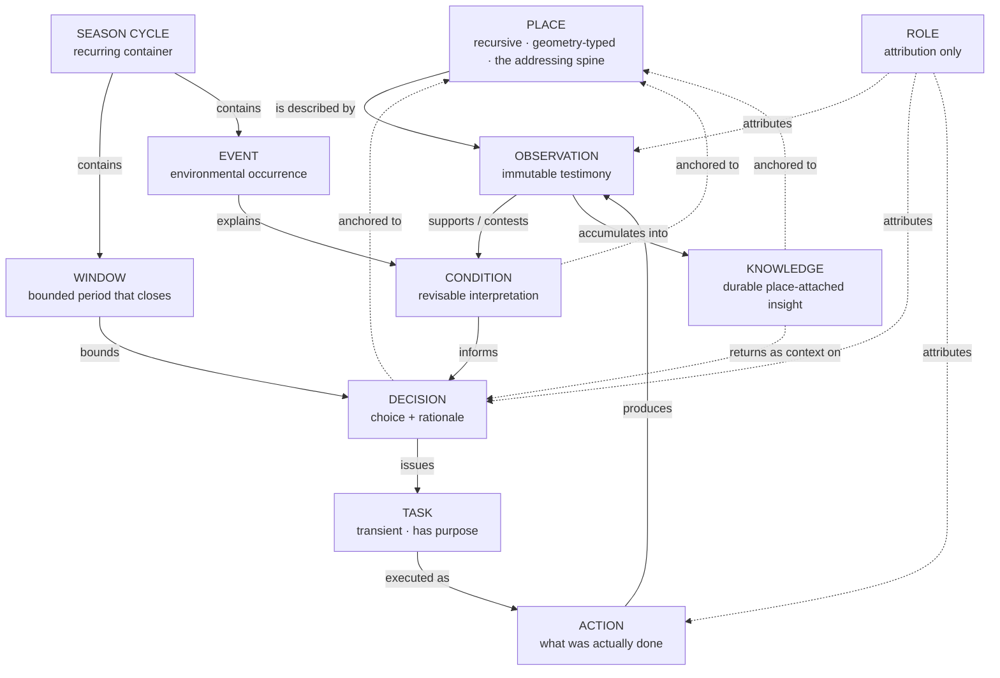
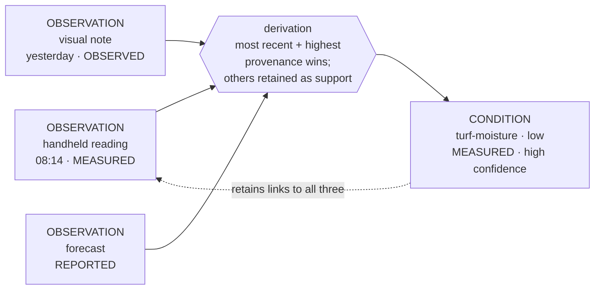
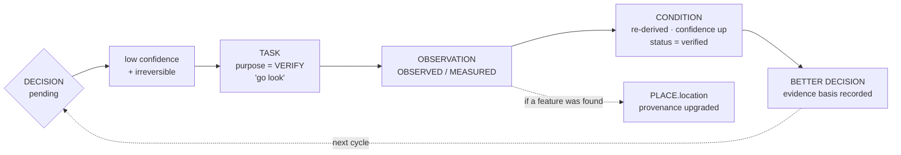
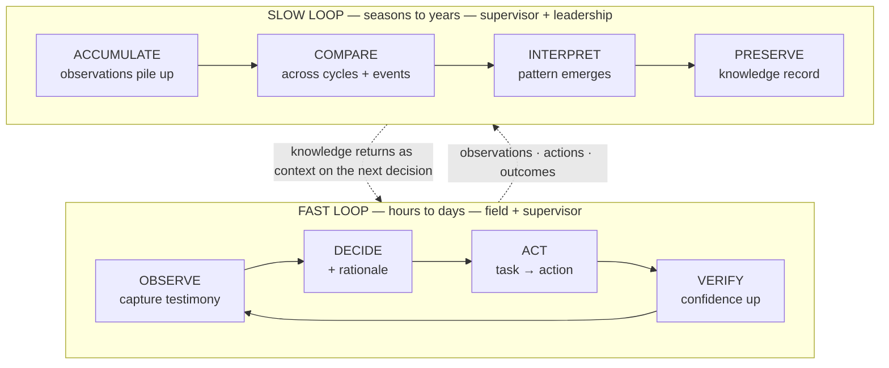
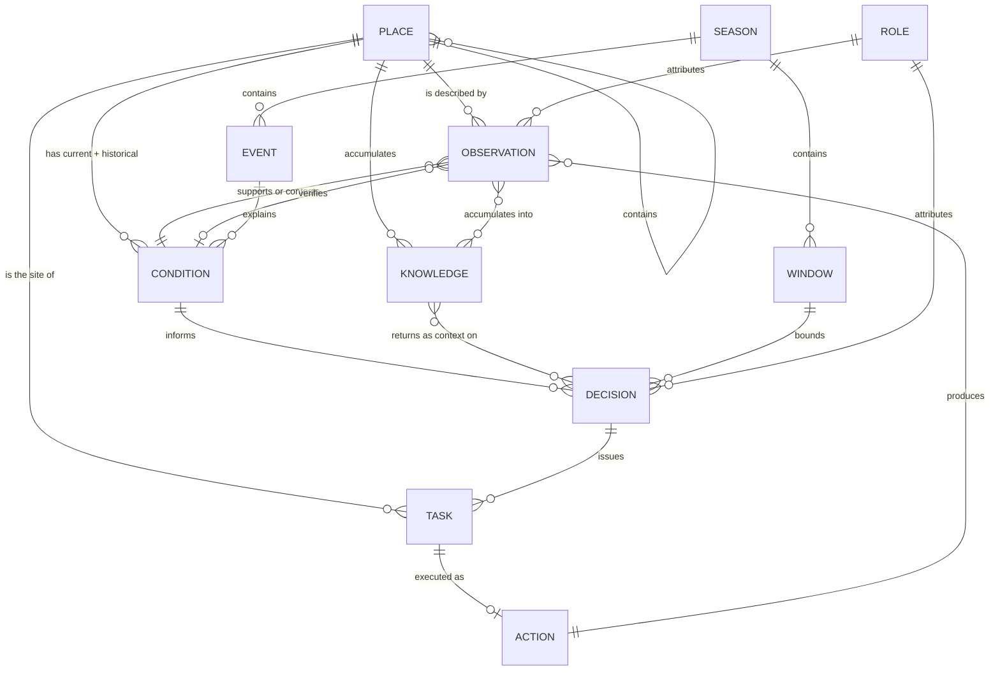
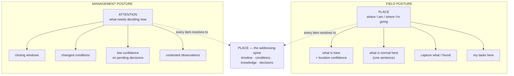
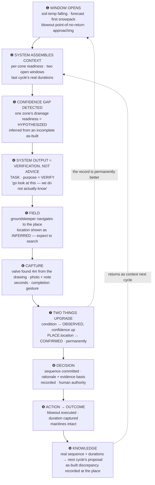

# 02 — Information Architecture

## Whitetail Club & Shore Lodge — Stewardship Intelligence System · Phase 03

**Phase:** 03 — Information & Product Architecture. Conceptual only: no visual design, no components, no code, no production schemas.
**Governed by:** [`00-project-governance.md`](00-project-governance.md) — **binding.**
**Derived from:** [`01-system-model.md`](01-system-model.md) (Phase 02) · [`research-to-design-handoff-v3.md`](research-to-design-handoff-v3.md) (v3.1) · [`source-register.md`](source-register.md).
**Evidence tags** per governance §4. **No claim here is `[VF]`** — all primaries remain unheld.

---

## 1 — Executive architecture summary

Phase 02 established that the root problem is **non-addressability**: the landscape has no persistent representation of its own state, history, and reasoning. Phase 03 asks what information structure actually delivers that, and the answer turned out to be **smaller than expected in one dimension and sharper in another.**

**Three architectural findings.**

**One addressable spine, not four physical types.** Phase 02 proposed five physical entities (domain, zone, feature, segment, surface). Architecturally they collapse into **one recursive `PLACE` object carrying a geometry type and a stewardship regime.** A valve is a point-place; a shoreline run is a line-place; a green is an area-place inside a zone-place inside a domain-place. This resolves Phase 02's open question M1, removes two object types, and — more importantly — gives the system a *single addressing spine*, which is precisely what design principle P1 demands. **Everything hangs off one hierarchy.**

**Context is not stored — it is composed.** `CONTEXT` looks like an object and is not one. It is a **computed view** assembled at the moment of a decision from season state, active windows, recent events, and place-attached knowledge. Storing it would freeze something whose entire purpose is to be evaluated fresh. This is the most consequential "not an object" call in the architecture.

**Verification is a task purpose, not a fifth wheel.** Phase 02 hypothesised *low provenance × irreversible decision → verification task.* Architecturally this needs **no new object**: a `TASK` gains a `purpose`, and the resulting `OBSERVATION` carries a link to the `CONDITION` it verifies. That small addition makes *"go look"* a dispatchable system output, and it closes a loop that upgrades the record permanently. **This is the product's differentiating mechanism, and it costs one attribute and one relationship.**

**The architecture in one line:** eleven objects, one spine, two tempos, and a confidence function — the smallest structure that can express the Phase 02 model without collapsing into a work-order system.

---

## 2 — Core information model

### 2.1 The shape



**Read the dotted lines as the ones that make it a stewardship system rather than a task tracker.** Everything anchors to `PLACE`; knowledge returns as context on future decisions; roles attribute without being tracked.

### 2.2 The two derived values

Neither is stored. Both are computed, and both are load-bearing.

| Derived value | Composed from | Why not stored |
|---|---|---|
| **CONTEXT** | Active season state + open windows + recent events + place-attached knowledge + current conditions | Its purpose is to be evaluated *now*. A stored context is a stale context. |
| **CONFIDENCE** | Condition provenance class × recency against that condition type's decay profile × contest status | A stored confidence value would be wrong within hours and would hide *why* it is what it is. |

---

## 3 — First-class information objects

Each candidate from the Phase 03 brief was tested: **does a decision in the model fail without it as a distinct object?** Eleven survived. What did not survive matters as much, and is recorded in §3.3 so nothing is silently re-added later.

### 3.1 The eleven

| # | Object | Persistence | Definition | Justified by |
|---|---|---|---|---|
| 1 | **PLACE** | Permanent | A named, locatable physical entity or area. **Recursive** (places contain places), **geometry-typed** (point / line / area), **regime-attributed**. Location carries provenance. | P1; incomplete as-builts `[SRC]` |
| 2 | **OBSERVATION** | Permanent, **immutable** | A human-made record of testimony at a place and time — note, photo, handheld reading. Role-attributed. **Never edited; only superseded.** | Phase 02 §3.3 |
| 3 | **CONDITION** | Historical | A derived, current, revisable interpretation of a place's state, carrying provenance and computed confidence. | Phase 02 §3.3 |
| 4 | **DECISION** | Permanent | A recorded human choice with **rationale, alternatives considered, and the provenance of the evidence it rested on.** | D1–D7; Phase 02 §8.3 |
| 5 | **TASK** | **Transient** | A unit of assigned work at a place, carrying a **purpose** (act / verify / inspect). Discarded on completion. | D6, D7; verification (§6) |
| 6 | **ACTION** | Permanent | What was actually done, by which role, when. **Separate from TASK because intent and execution diverge.** | Phase 02 §3.3 |
| 7 | **KNOWLEDGE RECORD** | Permanent | A synthesized, durable, place-attached insight derived from accumulated observations and outcomes. | Phase 02 §8 |
| 8 | **WINDOW** | Historical | A bounded period with a trigger, a closing condition, and a consequence-of-missing. | D2, D3 `[SRC]` |
| 9 | **EVENT** | Historical | An environmental occurrence — hard freeze, heat stretch, runoff peak. **The join key for temporal comparison.** | §8.3 |
| 10 | **SEASON CYCLE** | Historical | A named recurring container (e.g. a winterization cycle) grouping windows, events, decisions, and outcomes for comparison. | D3, D7 |
| 11 | **ROLE** | Permanent | A functional title. **Attribution and routing only.** | Governance §6 |

### 3.2 Why PLACE absorbs four Phase 02 entities

```
PHASE 02                          PHASE 03
────────                          ────────
DOMAIN   ─┐
ZONE     ─┤
SURFACE  ─┼──▶  PLACE { geometry: point | line | area,
SEGMENT  ─┤              regime:   turf | shoreline | drainage |
FEATURE  ─┘                        forest | infrastructure | hardscape | domain,
                          parent:   PLACE (recursive) }
```

**Worked instances:**

| Physical thing | As a PLACE |
|---|---|
| Whitetail Club | `area` · regime `domain` · no parent |
| A turf zone | `area` · regime `turf` · parent = domain |
| A putting green | `area` · regime `turf-putting` · parent = turf zone |
| An irrigation valve | `point` · regime `infrastructure` · parent = turf zone |
| A shoreline run | `line` · regime `shoreline` · parent = Shore Lodge |
| A drainage line | `line` · regime `drainage` · parent = zone |

**What this buys:** one addressing spine, one containment rule, one way to ask *"what is here and what is known about it."* Observations, conditions, decisions, and knowledge all attach to the same object type regardless of scale — so *"what is known about this green"* and *"what is known about this domain"* are the same query at different depths.

**What it risks:** over-abstraction flattening real semantic differences. **Mitigated by `regime`**, which is where the meaningful distinction actually lived — greens, native areas, and shoreline differ by *stewardship regime*, not by structural type. Phase 02's SURFACE was reaching for regime and reifying it as a type.

**Geometry is not decoration.** `line` places are the ones that **fail at a point along their length** — "the erosion is at the north end of this run." That was Phase 02's entire argument for SEGMENT, preserved as an attribute rather than a type.

### 3.3 Not first-class — and why

| Candidate | Verdict | Reasoning |
|---|---|---|
| **CONTEXT** | **Computed view** | Assembled at decision time from season, windows, events, knowledge, conditions. Storing it freezes the thing whose job is freshness. §2.2. |
| **EVIDENCE** | **Attribute set** | An `OBSERVATION` *is* evidence. Provenance is attributes on observation and condition. A separate evidence object would duplicate observation. |
| **VERIFICATION** | **Task purpose + relationship** | See §6. No object needed; `TASK.purpose = verify` plus `OBSERVATION.verifies → CONDITION`. |
| **ASSET** | **Renamed** | Becomes `PLACE(point)`. The word "asset" imports financial-lifecycle framing and pulls toward equipment management — the drift governance §12.2 excludes. |
| **PERSON** | **Deliberately unmodeled** | Only `ROLE` exists. Governance §6, enforced at the model layer so surveillance is structurally impossible, not merely discouraged. |
| **CONFIDENCE** | **Derived function** | Computed, never stored. §5.4. |
| **OUTCOME** | **Attribute of ACTION + later OBSERVATION** | An outcome is what a follow-up observation found. Making it an object would duplicate observation. |
| **RATIONALE** | **Attribute of DECISION** | Structurally inseparable from the decision. Separating it invites making it optional — and optional rationale is uncaptured rationale (P4). |
| **ALERT / NOTIFICATION** | **Not modeled** | A delivery mechanism, not information. Belongs to Phase 04. |
| **WEATHER** | **`EVENT` + reported condition** | External, `REPORTED` provenance. Not a distinct object type. |

> **The discipline here:** every rejected candidate was rejected because it was an attribute, a view, or a duplicate — not because it was uninteresting. Object count is the primary defence against a system that models the resort instead of the decisions.

---

## 4 — Observation / condition model

Phase 02 established the distinction. Phase 03 makes it operational, because this split is what makes provenance representable at all.

### 4.1 What each contains

| | **OBSERVATION** — testimony | **CONDITION** — interpretation |
|---|---|---|
| **Nature** | What a person found | What the system currently holds to be true |
| **Mutability** | **Immutable.** Never edited. | **Revisable.** Continuously re-derived. |
| **Contents** | place · timestamp · role · what was recorded (note / photo / reading) · how known (provenance class) · instrument if any | place · condition type · current value or state · supporting observations · provenance class · computed confidence · contest status · last-derived timestamp |
| **Cardinality** | Many per place, forever | **One current per (place, condition type)** — with full history retained |
| **On being wrong** | **Stays true.** It records what someone saw. | Superseded. The old value moves to history. |
| **Persistence class** | Permanent | Historical |

> **The asymmetry is the point.** When a condition turns out to be wrong, the observations beneath it remain valid — someone did see what they saw. **Only the interpretation was wrong.** A single merged record cannot express this, which is why flattening them destroys the model.

### 4.2 Derivation



**Rules:**

1. **A condition always cites its supporting observations.** No orphan conditions — a condition with no observation beneath it is an *inference*, and must be provenance-classed as such.
2. **Many observations, one condition.** Three crew members observing the same zone produce three observations and one derived condition.
3. **The strongest recent observation dominates**, but weaker ones are retained as support — they are what make the condition auditable later.
4. **Derivation is re-run, not overwritten.** Prior condition values move to history with their own timestamps, which is what makes §8 comparison possible.

### 4.3 Contradiction

Observations *can* disagree, and the architecture must not resolve this silently.

```
   OBSERVATION A: "drainage clear"      OBSERVED · yesterday · crew
   OBSERVATION B: "standing water here" OBSERVED · today    · crew
                          │
                          ▼
   CONDITION: drainage-state = CONTESTED
              confidence: suppressed
              both observations retained
```

**Contradiction is information, not error.** Two honest observations disagreeing usually means something changed, someone looked at a different spot, or the place is more heterogeneous than the model assumes — all worth knowing.

> **The architectural consequence:** `CONTESTED` suppresses computed confidence, and **suppressed confidence on an irreversible decision triggers verification** (§6). Contradiction routes directly into "go look." This is the cleanest possible join between §4 and §6, and it required no additional machinery.

### 4.4 Change and expiry over time

**Conditions do not expire. They decay.**

Deleting an old condition would destroy the historical series that makes cross-time comparison possible. Instead, confidence declines along a **decay profile owned by the condition type** — which resolves Phase 02's open question **M2**.

| Condition type | Decay profile | Rationale |
|---|---|---|
| Turf moisture | **Hours** | Physically volatile |
| Frost / surface temperature | **Minutes to hours** | The D2 decision window itself |
| Drainage obstruction | **Days to weeks** | Changes with weather and use |
| Erosion extent | **Seasons** | Cumulative, slow |
| **Feature location** | **Does not decay** | A valve does not move. Confidence is capped by provenance alone. |
| Seasonal readiness | **Bounded by its window** | Meaningless outside it |

**Decay rate is a property of the condition type, not of the reading.** This is the correct place for it: "how fast does knowing this go stale" is a fact about *what is being known*, not about who looked.

---

## 5 — Provenance model

### 5.1 The seven questions

Every observation and condition must be able to answer:

| Question | Observation | Condition |
|---|---|---|
| **WHO / ROLE** | Role that recorded it | Roles behind supporting observations |
| **WHEN** | Capture timestamp | Last-derived + oldest supporting observation |
| **WHERE** | The place | The place |
| **HOW KNOWN** | Provenance class | Class of the dominant supporting observation |
| **SOURCE** | Instrument, direct sight, or external report | Supporting observation set |
| **CONFIDENCE** | *(not applicable — testimony)* | **Computed** — §5.4 |
| **STATUS** | Current / superseded | Current / contested / stale / verified |

### 5.2 The five classes

| Class | Definition | Example `[SRC]` unless marked |
|---|---|---|
| **MEASURED** | An instrument produced a value | Handheld moisture or soil-temperature reading |
| **OBSERVED** | A person directly saw and recorded it | Crew photo of a blocked culvert |
| **REPORTED** | Received without direct witness | Public forecast; a third-hand account |
| **INFERRED** | Derived by rule from other data | "Likely dry" from elapsed time + conditions `[RSI]` |
| **HYPOTHESIZED** | Assumed for planning; no supporting evidence | Valve position taken from an incomplete as-built `[DH]` |

**Not a quality ranking.** A three-week-old measurement may be worth less than this morning's observation. Class sets a *ceiling*; recency and contest status determine where under it the condition actually sits.

### 5.3 What provenance affects

Tested per effect, so it does not become decorative metadata:

| Effect | Applies? | Rule |
|---|---|---|
| **Decision confidence** | **Yes — primary** | Confidence travels with the condition to the decision. |
| **Escalation / verification** | **Yes — primary** | Low provenance × irreversible → verification task (§6). |
| **Historical record** | **Yes** | Provenance is preserved permanently. *"We decided on inferred data"* is what makes a retrospective useful. |
| **Visibility** | **Conditional** | Surfaced **only where it would change the action.** Uniform display is noise that trains people to ignore it. |
| **Whether a condition may exist** | **No** | A `HYPOTHESIZED` condition is legitimate — it is how an incomplete as-built enters the system honestly. |

### 5.4 Confidence as a function

```
CONFIDENCE( condition ) =
      provenance_ceiling( dominant_observation.class )
    × recency_factor( now − observation.timestamp , type.decay_profile )
    × contest_penalty( contested ? suppressed : 1 )
```

Three properties worth stating:

- **Never stored.** Computed on read, so it is never stale.
- **Always explainable.** Every input is inspectable — the system can always answer *"why is this uncertain?"* This matters more than the number.
- **Bounded by class.** No amount of recency lifts a `HYPOTHESIZED` condition to high confidence. **Only a verification does.**

### 5.5 Where provenance rides

| Object | Carries provenance? | Note |
|---|---|---|
| **CONDITION** | **Yes — essential** | The primary case. |
| **PLACE.location** | **Yes — essential** | Surveyed vs. confirmed-in-field vs. inferred-from-drawing. **Directly required by incomplete as-builts** `[SRC]` and the concrete backbone of D4. |
| **DECISION.evidence_basis** | **Yes** | Snapshot of the confidence its inputs carried *at the moment of decision*. |
| **KNOWLEDGE RECORD** | **Yes — derived** | A pattern from twelve observations differs from one from two. |
| **OBSERVATION** | **No — it *is* provenance** | Carries class, role, time. Asking its provenance is circular. |
| **ACTION** | **No** | It happened or it did not. |
| **PLACE.identity** | **No** | Definitional. Only *location* is uncertain. |

---

## 6 — Verification model

Phase 02 proposed verification as a hypothesis. Phase 03 tested it architecturally against five framings.

### 6.1 Testing the five framings

| Framing | Consequence | Verdict |
|---|---|---|
| **A separate object** | New type duplicating most of `TASK`; two dispatch paths; two inboxes | **Rejected** — object bloat with no expressive gain |
| **An action** | Verification would produce an `ACTION`, implying the landscape was changed. **It was not — someone looked.** | **Rejected** — semantically wrong |
| **A workflow state** | State on what? Conditions have status but a *pending look* is work, not a state | **Insufficient alone** |
| **An event** | Events are environmental occurrences, not intentions | **Rejected** |
| **A decision type** | A decision to verify is real, but conflates deciding with the work | **Partial** |

### 6.2 The resolution — a combination, costing one attribute and one relationship

```
TASK.purpose        ∈ { ACT , VERIFY , INSPECT }        ← makes "go look" dispatchable
OBSERVATION.verifies → CONDITION                        ← closes the loop
CONDITION.status     ∈ { current , contested , stale , verified }
```

**That is the entire mechanism.** No new object. A verification task is a task whose purpose is to raise confidence rather than change the landscape; the observation it produces links to the condition it was sent to check; the condition's provenance and status update as a consequence.

### 6.3 The verification loop



### 6.4 Is this a defining loop?

**Yes — and it is the product's clearest differentiator.**

Most decision-support systems have exactly two responses to uncertainty: present it as a caveat, or hide it. **This one has a third: dispatch a person to resolve it.** That is only possible because the system knows *how* it knows what it claims, and because a human is already going to be out there.

Three properties make it structurally valuable:

1. **It converts uncertainty into work** — a caveat is passive; a task is actionable.
2. **It upgrades the record permanently** — the confirmed condition and any confirmed feature location persist (§5.5). **The system gets better at knowing the place, not just at reporting it.**
3. **It is the only mechanism that raises a `HYPOTHESIZED` condition.** Decay can only lower confidence; verification is the sole upward path. Without it, an incomplete as-built stays permanently unreliable and the spatial record never repairs itself.

> **Verification is where governance §1's thesis becomes a mechanism.** "Making the landscape knowable" is not a slogan here — it is a loop that measurably increases what is known, driven by work that was happening anyway.

---

## 7 — Two-tempo system architecture

Phase 02's central finding was that the seven nodes form **two coupled loops at different tempos**, and that the coupling is the product. Phase 03 must ensure the information architecture cannot quietly discard one.

### 7.1 The two loops as information flows



### 7.2 The intersection — exactly two crossings

The loops touch at **two points only**, and naming them precisely is what keeps the architecture honest:

| Crossing | Direction | What passes | Mechanism |
|---|---|---|---|
| **Deposit** | Fast → Slow | `OBSERVATION`, `ACTION`, `DECISION` + outcome | Byproduct of doing the work — no separate authoring step (P3) |
| **Return** | Slow → Fast | `KNOWLEDGE RECORD` surfaced as context on a decision at that place | Place-anchored retrieval (P7) |

> **These two crossings are the product.** Everything else in the architecture serves one loop or the other. A system with only the deposit is an archive nobody reads; with only the return, a wiki with nothing feeding it.

### 7.3 What belongs exclusively to each

| **Fast loop only** | **Shared** | **Slow loop only** |
|---|---|---|
| `TASK` (transient) | `PLACE` | `KNOWLEDGE RECORD` |
| Current `CONDITION` + confidence | `OBSERVATION` | `SEASON CYCLE` comparison |
| Open `WINDOW` state | `DECISION` | Multi-cycle pattern |
| Dispatch and assignment | `ACTION` | Outcome-to-decision correlation |
| Verification queue | `EVENT` | Decay-profile calibration |

**`TASK` is the only object exclusive to the fast loop and transient** — which is exactly why a work-order system feels complete while accumulating nothing. Tasks are the part that legitimately disappears.

### 7.4 Removal tests

**If the slow loop were removed** — no knowledge records, no cross-cycle comparison — the system still captures observations, derives conditions, dispatches tasks, and records decisions. **It would work.** And it would be a work-order tool with unusually good provenance. Six of seven decisions (Phase 02 §7.1) depend on *"what happened last time here"*; without the slow loop they degrade to *"what is happening now"* — which is precisely the reactive posture the project exists to address. **D2 and D6 become impossible**: you cannot judge a thaw rate or "is this normal here" without accumulated history.

**If the fast loop were removed** — knowledge without daily work — nothing generates observations. The slow loop starves. It becomes a wiki maintained by people who must stop working to maintain it, which is the failure mode P3 exists to prevent.

> **The asymmetry is instructive.** Remove the slow loop and you get a *plausible, shippable, worse* product — which is exactly why it is the one at risk under scope pressure (Phase 02 R6). Remove the fast loop and the failure is obvious immediately. **The dangerous cut is the one that still demos well.**

---

## 8 — Temporal model

### 8.1 The governing question

> **What should someone be able to understand about this place three years from now — without asking anyone who was there?**

Everything in this section serves that. The test of the temporal model is whether a person can reconstruct a place's history from the record alone.

### 8.2 Five temporal representations

| Representation | Structure | Answers |
|---|---|---|
| **Current state** | Latest derived `CONDITION` per (place, type) + confidence | *What is true here now, and how sure are we?* |
| **Historical state** | Full `CONDITION` series + all `OBSERVATION`s, never deleted | *What was true here on any past date?* |
| **Seasonal state** | `SEASON CYCLE` + place seasonal state + `WINDOW` outcomes | *Where are we in the cycle, and how did this cycle compare?* |
| **Recurring pattern** | `KNOWLEDGE RECORD` derived across cycles | *What does this place reliably do?* |
| **Point-in-time record** | `DECISION` with evidence basis; `OBSERVATION` with timestamp | *What did we know, and choose, at that moment?* |

### 8.3 EVENT as the comparison key

The hardest temporal question in the model is not *"what happened in October"* — it is **"what happened last time conditions looked like this."** Dates do not answer that. `EVENT` does.

```
   EVENT: "hard freeze"  ·  2026-10-14  ·  severity  ·  affected places
              │
              ├── conditions recorded during it
              ├── decisions made under it
              ├── actions taken in response
              └── outcomes that followed
```

Because events are typed and recurring, the system can retrieve **the last comparable situation** rather than the last calendar equivalent. This is what turns D7's *"what did deferral cost last time"* and D2's *"how fast did this surface thaw under these conditions"* into answerable questions.

> **`EVENT` is the object that makes the slow loop queryable.** Without it, history is a chronological pile; with it, history is comparable.

### 8.4 The place timeline

Because every object is timestamped and place-anchored, each place has a readable history for free:

```
   PLACE: green · shaded · parent = turf zone
   ─────────────────────────────────────────────────────────
   2026-10-14  EVENT      hard freeze
   2026-10-14  OBSERVATION frost present, 07:02, MEASURED
   2026-10-14  DECISION    delay 45 min — "this surface historically
                           thaws ~40 min behind the others"
   2026-10-14  ACTION      delay applied
   2026-10-14  OBSERVATION cleared 07:48 — estimate held
   2026-11-02  KNOWLEDGE   thaw lag ~40–50 min under clear cold
                           (derived from 9 observations, 2 cycles)
```

**Three years later, a person reads this and understands the place** — what happened, what was decided, why, and what was learned. **No institutional memory required.** That is the temporal model's entire purpose, and the concrete answer to §8.1.

---

## 9 — Spatial model

### 9.1 Hierarchy — recursive, not fixed-depth

The brief proposed `PROPERTY → DOMAIN → ZONE → ASSET → LOCATION`. **Rejected as a fixed hierarchy** — real landscapes do not nest to uniform depth, and a fixed ladder forces artificial levels.

```
   PLACE (recursive containment, geometry-typed)

   Whitetail Club          area · domain
     └─ turf zone          area · turf
          ├─ green         area · turf-putting
          │    └─ valve    point · infrastructure
          └─ drainage line line · drainage

   Shore Lodge             area · domain
     └─ shoreline run      line · shoreline
          └─ access point  point · hardscape
```

**Containment is the only structural rule.** Depth varies by need — a place may sit two levels down or five. A drainage line may be parented to a zone while physically crossing several, so **containment is administrative, not strictly geometric.**

### 9.2 Resolution required, by purpose

Resolution is not uniform. Testing per purpose prevents both over- and under-modeling:

| Purpose | Resolution needed | Why |
|---|---|---|
| **Navigation** | Zone → place, with location provenance | Finding a valve is the literal Domain A problem |
| **Observation** | The place being observed, at whatever depth | Crew observe greens *and* whole zones |
| **Decision** | Usually zone; sometimes sub-place | D1 targets a *sub-area*; D3 operates zone-wide |
| **History** | The place the observation attached to | Timeline is per-place; roll-up via containment |
| **Comparison** | Same place, or same regime across places | *"All shaded greens"* is a regime query |
| **Verification** | **Precise point** | "Go look" needs somewhere specific to stand |

**Verification sets the floor.** The system must be spatially precise enough to send a person to a specific thing — that requirement, not analysis, determines minimum resolution.

### 9.3 Addressable, not GIS

| The system does | The system does not |
|---|---|
| Make places findable and nameable | Perform spatial analysis or topology |
| Hold location with provenance | Maintain survey-grade geometry |
| Support containment and adjacency | Model hydraulic or utility networks |
| Anchor information to ground | Serve as a system of record for parcels |
| Import base layers as context `[DH]` | Provide GIS administration |

> **The distinction:** a GIS answers *"what is the spatial relationship between these features."* This system answers **"what do I need to know about where I am standing."** The first is analysis; the second is legibility — and only the second is on-thesis (governance §1).

### 9.4 Location provenance — the concrete payoff

| Location provenance | Meaning | Operational consequence |
|---|---|---|
| **SURVEYED** | Precisely recorded | Trust it |
| **CONFIRMED** | Someone stood on it and recorded it | Trust it; note when |
| **INFERRED** | Derived from a drawing or adjacent evidence | Approximate — expect to search |
| **HYPOTHESIZED** | Assumed from an incomplete as-built `[SRC]` | **May not exist as recorded — verify before excavating** |

This is the most concretely useful application of provenance in the entire architecture. *"There is a valve here"* and *"there should be a valve here per a drawing of unknown accuracy"* are different operational facts, and **a crew about to dig needs the difference.**

---

## 10 — Information relationships

### 10.1 The refined graph

The brief's proposed relationships were tested. Most hold; three needed correction.



### 10.2 Three corrections to the proposed model

| Proposed | Corrected | Why |
|---|---|---|
| `OBSERVATION describes CONDITION` | **`OBSERVATION supports or contests CONDITION`** | "Describes" implies one-to-one and hides disagreement. Support/contest carries cardinality *and* §4.3. |
| `DECISION creates ACTION` | **`DECISION issues TASK; TASK is executed as ACTION`** | Decisions do not act — they assign. **The task/action gap is where intent and execution diverge**, and that gap is informative. |
| `CONDITION exists within CONTEXT` | **Context is composed at decision time, not a containing object** | §2.2. Nothing "exists within" a computed view. |

### 10.3 The four relationships that carry the thesis

Strip these and the model is a task tracker with good metadata:

| Relationship | Carries |
|---|---|
| **`PLACE contains PLACE`** | The addressing spine (P1). One recursive rule makes the landscape navigable at any scale. |
| **`OBSERVATION supports/contests CONDITION`** | Provenance representability (§4). Testimony and interpretation stay distinct. |
| **`OBSERVATION accumulates into KNOWLEDGE`** | **The compounding edge.** Many observations at one place over seasons become an insight. This single edge is the difference between a log and an institutional memory. |
| **`KNOWLEDGE returns as context on DECISION`** | Loop closure (§7.2). Without it the slow loop is write-only. |

---

## 11 — Decision architecture

### 11.1 Principle: relevance over completeness

**Information completeness at the moment of decision is a failure mode, not a goal.** A person deciding whether to delay play at 06:00 in the cold does not need everything known about that surface — they need the few things that change the answer.

Each decision therefore has a defined **information envelope**: what must be present, what must be reachable, and what must be excluded.

### 11.2 D2 — Frost delay *(the sharpest decision in the model)*

```
INPUTS        surface temperature reading · frost presence · time
              ↓
CONTEXT       air temp + sun angle · scheduled play · THIS surface's
              historical thaw lag (KNOWLEDGE — slow loop returning)
              ↓
CONDITION     frost-state · MEASURED · minutes old · high confidence
              ↓
DECISION      open / delay / partial + rationale + evidence basis
              ↓
ACTION        delay applied and communicated
              ↓
VERIFICATION  actual clear time observed — did the estimate hold?
              ↓
OUTCOME       turf protected / damaged · revenue held / lost
              ↓
KNOWLEDGE     thaw-lag profile for this surface, refined
```

| Envelope | Content |
|---|---|
| **Must be present** | Current frost condition + confidence · **historical thaw lag for this specific surface** · time until scheduled play |
| **Must be reachable** | Comparable past mornings · adjacent surface states |
| **Must be excluded** | Everything else. **A decision made in minutes cannot afford a browse.** |

**Why it is architecturally instructive:** the single most valuable input — *this surface's historical thaw lag* — is a slow-loop product delivered into a fast-loop moment. **The two-tempo coupling is not abstract here; it is the decision.**

### 11.3 D3 — Winterization sequencing *(the irreversible one)*

```
INPUTS        soil temperature trend · forecast · per-zone readiness
              ↓
CONTEXT       TWO open WINDOWs (blowout point-of-no-return; ~48h snow
              mold) · crew capacity · last cycle's real durations
              ↓
CONDITION     per-zone readiness — MIXED PROVENANCE, some HYPOTHESIZED
              ↓
              ⚠ low confidence × irreversible
              ↓
VERIFICATION  "go look" tasks issued for low-confidence zones FIRST
              ↓
DECISION      sequence committed / overridden + rationale
              ↓
ACTION        blowout · fungicide · marking
              ↓
OUTCOME       assets protected / mainlines cracked · turf held / lost
              ↓
KNOWLEDGE     real sequence + real durations → next cycle's proposal
```

| Envelope | Content |
|---|---|
| **Must be present** | Which windows are open and closing · per-zone readiness **with confidence** · consequence-of-missing |
| **Must be reachable** | Last cycle's actual sequence and durations · override history |
| **Must be excluded** | Anything implying the system will sequence autonomously |

**Why it is the architectural centrepiece:** it is the only decision where **verification precedes the decision rather than following the action.** Low-confidence readiness does not produce a hedged recommendation — it produces *"look at these three zones first."* That inversion is the product's distinctive behaviour.

### 11.4 D6 — Is this normal here? *(the field decision)*

```
INPUTS        what the crew member is looking at · where they are
              ↓
CONTEXT       what this PLACE normally does (KNOWLEDGE) · recent
              conditions here · whether others have flagged it
              ↓
DECISION      proceed / handle / escalate
              ↓
OBSERVATION   photo + note — seconds, no navigation
              ↓
KNOWLEDGE     anomaly frequency + clustering at this place
```

| Envelope | Content |
|---|---|
| **Must be present** | *"What is normal here"* — one short place-attached statement |
| **Must be reachable** | Recent observations at this place |
| **Must be excluded** | Analysis, trends, comparisons. **A person standing in a field with gloves on needs one sentence, not a history.** `[DH]` |

**Why it matters architecturally:** this is the **only decision whose primary input is a knowledge record.** It is the purest demonstration that the slow loop pays the fast loop back — and it is the crack in the dispatch bottleneck (Phase 02 §6.1). If knowledge cannot be delivered in one sentence to a gloved hand, D6 fails and authority stays centralized.

### 11.5 What the three reveal

1. **Every decision needs knowledge more than data.** In all three the highest-value input is a slow-loop product, not a current reading.
2. **The envelope must be narrower than the record.** Architecture must support *withholding* — completeness at the moment of decision is noise.
3. **Verification's position varies.** In D2 it follows the action (did the estimate hold); in D3 it precedes the decision (which zones do we not know). **The architecture must permit both orderings** — which the task-purpose model does naturally, and a fixed workflow state would not.

---

## 12 — User role architecture

Three roles. **Functional titles only** (governance §6); no individuals modeled (§3.3).

| | **Seasonal Groundskeeper** | **Superintendent / Grounds Director** | **Operations Leadership** |
|---|---|---|---|
| **Responsibility** | Execute work; observe and record | Decide, sequence, dispatch; hold the operational picture | Set policy and seasonal strategy; steward long-term condition |
| **Information needs** | *Where is it · what is it · what is normal here · what am I looking for* | Current conditions **+ confidence** · what changed · what is closing · what happened last time | Patterns across cycles; whether knowledge is accumulating |
| **Decision authority** | **D6 only** — proceed / handle / escalate | **D1–D5, D7** — nearly all operational authority | Policy, sequencing priorities, investment |
| **Context** | **Field** — mobile, gloved, variable connectivity `[DH]` | **Split** — desk, truck, field; needs two detail levels | **Desk** |
| **Temporal needs** | **Now.** Occasionally "recently here" | Hours → season; **cross-cycle for D3/D7** | Multi-cycle only |
| **Spatial needs** | **Precise** — must find a specific thing | Zone-level, with drill-down | Domain/property-level roll-up |
| **Evidence needs** | *Is this reliable enough to act on* — mostly implicit | **Explicit confidence** — the primary consumer of provenance | Provenance of knowledge records: how well-founded is this pattern |

### 12.1 Architectural consequences

- **The groundskeeper writes far more than they read**, and both must be near-free. Capture is the completion gesture (P3); reading is one sentence (§11.4).
- **The superintendent is the primary consumer of confidence.** Provenance visibility (§5.3) is designed principally for this role and this moment.
- **Leadership reads the slow loop only** — and must not drive the architecture. Designing the whole system for the aggregate view is the classic way these systems fail their field users.
- **Role attributes; it does not measure.** `ROLE` exists for attribution and routing. **No per-individual productivity data is modeled at all** — enforced structurally (§3.3), not by policy.

---

## 13 — Product capability architecture

Capabilities are defined **only now**, after the information model, and only where a complete chain exists:

> **SYSTEM REQUIREMENT → INFORMATION REQUIREMENT → USER DECISION → WORKFLOW → CAPABILITY**

The Phase 01/02 set (PLACE · CHANGE · DECISION · KNOWLEDGE) was **restructured, not preserved.** Those four were problem-domain names inherited from research. The architecture produces a different and better-motivated six: two capabilities were promoted out of implicitness because the model shows they are load-bearing.

### 13.1 The six

| # | Capability | Who | When | Decision supported | Action enabled | Knowledge preserved |
|---|---|---|---|---|---|---|
| **C1** | **Place Register**<br/>*addressing + location provenance* | All roles | Standing anywhere; planning anything | Every decision — it is the substrate | Find and reach a specific thing | Confirmed locations; the spatial record itself |
| **C2** | **Field Capture**<br/>*observation as completion gesture* | Groundskeeper (primary) | During and after work | D6 | Record in seconds without navigating | **Every observation — the raw material of everything** |
| **C3** | **Condition & Confidence**<br/>*derived state + provenance* | Superintendent | Assessing before deciding | D1, D2, D4, D5 | Read state *and* how well it is known | Condition history per place |
| **C4** | **Verification**<br/>*"go look" as dispatchable work* | Superintendent → Groundskeeper | When confidence is low and stakes irreversible | D3 (before), D2 (after) | Resolve uncertainty deliberately | **Upgraded provenance — permanently** |
| **C5** | **Decision Support**<br/>*envelope + closing windows + rationale capture* | Superintendent | At the moment of choice | D1, D2, D3, D5, D7 | Decide with the right few facts; record why | **Rationale + evidence basis — the artifact that does not exist today** |
| **C6** | **Institutional Memory**<br/>*accumulation, comparison, return* | Superintendent, Leadership | Before deciding; after cycles | D2, D6, D7 and all via context return | Compare across time and events | Patterns, seasonal timings, lessons, outcomes |

### 13.2 What changed from the inherited four, and why

| Phase 01/02 | Phase 03 | Reason |
|---|---|---|
| PLACE | **C1 Place Register** | Sharpened: the deliverable is *addressability with location provenance*, not mapping |
| CHANGE | **C3 Condition & Confidence** | "Change" described a phenomenon; the capability is *knowing state and how well it is known* |
| — | **C2 Field Capture** *(promoted)* | Was implicit inside KNOWLEDGE. **P3 makes it existential** — if capture fails, everything downstream fails (Phase 02 R1). A dependency this total must be named. |
| — | **C4 Verification** *(promoted)* | Emerged from §6 as the **differentiating mechanism** and the only upward path for confidence |
| DECISION | **C5 Decision Support** | Absorbs closing-window state; rationale capture made explicit rather than assumed |
| KNOWLEDGE | **C6 Institutional Memory** | Narrowed to accumulation, comparison, and return — capture moved to C2 where it belongs |

> **The promotion of C2 and C4 is the architecture talking back.** Neither was in the research. Both fall out of the information model: capture because the knowledge model has no input without it, verification because confidence has no upward path without it.

### 13.3 Capability-to-loop mapping

```
   FAST LOOP        C1 · C2 · C3 · C4 · C5
   SLOW LOOP        C1 · C2 ·           C6
   THE CROSSINGS    C2 (deposit)  ·  C6 (return)
```

**C1 and C2 serve both loops** — which is why they are the foundation. C2 in particular *is* the deposit crossing: the mechanism by which the fast loop pays the slow loop.

---

## 14 — Conceptual navigation architecture

**Conceptual only** — structure, not visual design.

### 14.1 The question

> **How would a person naturally enter this system?**

Candidates: PLACE · DECISION · CONDITION · TASK · HISTORY. Tested against the two postures, and the answer is **dual-rooted**, because the postures genuinely differ.

| Entry | Natural for | Verdict |
|---|---|---|
| **PLACE** | Field — *"I am standing here"* | **PRIMARY (field)** |
| **ATTENTION** *(what needs deciding)* | Management — *"what needs me"* | **PRIMARY (management)** |
| **TASK** | Field — *"what am I assigned"* | Secondary — resolves to a place |
| **CONDITION** | Management — *"what changed"* | Secondary — a filter over attention |
| **HISTORY** | Both — *"what happened here"* | Secondary — always reached *through* a place |

### 14.2 Two roots, one spine



### 14.3 The governing rule

> **Every entry point resolves to a place.** Attention, tasks, conditions, and history are all *routes into the spine*, never parallel hierarchies.

This is P1 expressed as navigation. A task that cannot be resolved to a place is not a valid task; a condition that cannot be resolved to a place is not a valid condition. **One spine, several doors.**

### 14.4 Why ATTENTION rather than a status overview

`ATTENTION` is deliberately **not** a general property overview. It is a **queue derived from the decision model** — closing windows (D3), changed conditions (D1/D4/D5), low confidence on pending irreversible decisions (§6), and contested observations (§4.3).

**Scoped to what needs a human**, not to what is happening. Phase 02 established that only D3 and D7 are cross-place and therefore the only justification for any property-wide view. **A general status overview would be the dashboard drift governance §1 forbids** — it answers *"how are things"* rather than *"what needs me."*

### 14.5 Global context

Present regardless of entry, because it changes the meaning of everything else: **active season and cycle · open windows and time remaining · significant recent events · current domain.**

---

## 15 — Signature workflow

### 15.1 Testing the proposed chain

The brief proposes `PLACE → OBSERVATION → CONDITION → CONTEXT → DECISION → ACTION → VERIFICATION → KNOWLEDGE`. It is **structurally correct but positions verification weakly** — as a step after action, which is only one of its two orderings (§11.5), and the less distinctive one.

**The stronger signature places verification *before* the decision**, because that is where the product does something other systems do not.

### 15.2 The signature workflow — *"The Uncertain Valve"*

A D3/D4 composite. Every step is attested `[SRC]` or a modeled mechanism; nothing requires technology that does not exist.



### 15.3 Why this is the signature

It demonstrates, in one continuous walk, everything the project claims:

| Step | Demonstrates |
|---|---|
| ❶ | Windows as first-class; condition-triggered, not calendar-driven |
| ❷ | Two-tempo coupling — last cycle's durations returning into this cycle's decision |
| ❸ | **Provenance doing real work** — the system knows what it does not know |
| ❹ | **The differentiator** — uncertainty becomes dispatchable work, not a caveat |
| ❺ | Location provenance changing field behaviour — *expect to search* |
| ❻ | Capture as completion gesture (P3) |
| ❼ | **Self-improving record** (P8) — the spatial record repairs itself through ordinary work |
| ❽ | Human authority preserved; rationale captured (P4) |
| ❾ | Intent vs. execution; outcome recorded |
| ❿ | Slow loop closing — and the as-built discrepancy is now permanent knowledge |

> **The single frame that carries the case study:** the moment at step ❹ where the system, asked for a recommendation, answers *"I don't know well enough — go look."* **That is a stewardship system declining to fake confidence** — and it is only possible because provenance is in the information model rather than the interface.

**It also resolves the Phase 02 test** (§11.3 there): *one field observation becoming organizational memory that changes a future decision.* Here it does that **and** permanently repairs the record of the physical world.

---

## 16 — MVP boundary

The MVP must demonstrate the thesis, not build a resort operating system.

### 16.1 Four tiers

| Tier | Contents | Rationale |
|---|---|---|
| **CORE**<br/>*the thesis is unprovable without these* | **C1** Place Register (recursive places + location provenance) · **C2** Field Capture (observation, seconds) · **C3** Condition & Confidence (derivation + decay) · **C4** Verification (task purpose + upgrade loop) · **C5** Decision Support for **D2 and D3** with rationale capture · **C6** minimum memory: place timeline + knowledge records | Exactly the signature workflow (§15). Remove any one and the walk breaks. |
| **IMPORTANT**<br/>*needed for a complete product, not to prove the thesis* | Remaining decisions D1, D4, D5, D7 · cross-cycle comparison · `EVENT`-keyed retrieval · contested-observation handling · cross-place sequencing view (D3/D7 only) · Shore Lodge domain depth | Real value; the argument stands without them. |
| **FUTURE**<br/>*plausible, not now* | Base-layer spatial import `[DH]` · weather service integration `[DH]` · organizational record import at HYPOTHESIZED provenance `[DH]` · offline sync `[DH]` · multilingual capture `[DH]` | Each an enhancement to a system that already works with a person, a phone, and a place. |
| **SPECULATIVE**<br/>*`[SC]` — must be labeled wherever shown* | Fixed sensor networks · continuous telemetry · aerial/drone imagery · predictive models · automated irrigation | **Does not exist.** The model accommodates without depending (Phase 02 §5.3). |

### 16.2 The MVP test

> **Can the system walk §15 end to end with nothing but a person, a phone, a place, and a handheld instrument?**

If yes, the thesis is demonstrated. **If any step requires an integration, a sensor, or a data import, the MVP has exceeded its evidence.**

### 16.3 Deliberate MVP asymmetry

The MVP covers **two decisions (D2, D3), not seven.** D2 is the sharpest; D3 is the most irreversible and the only one where verification precedes decision. Together they exercise all six capabilities, both loops, both crossings, and both postures.

**Five decisions deferred is not a gap — it is the point.** A system demonstrating two decisions completely is a stronger argument than one gesturing at seven.

---

## 17 — Rejected / deferred capabilities

Rejected **on architectural grounds**, not lack of interest. Recorded so they are not silently re-added.

| Capability | Status | Why |
|---|---|---|
| **Generic work orders** | **REJECTED** | `TASK` exists only to connect decisions to actions and give capture a moment to attach to. **If task management becomes the centre, the landscape becomes metadata.** The transient persistence class (§3.1) enforces this structurally. |
| **HR / productivity monitoring** | **REJECTED — permanently** | `PERSON` is not modeled (§3.3). Structurally impossible, not merely prohibited. Governance §5 G8. |
| **Autonomous maintenance / prescriptive automation** | **REJECTED** | Every loop closes through a human decision (Phase 02 §10). The override is the boundary made visible. |
| **Speculative sensor networks presented as current** | **REJECTED** | Governance G4. `CONDITION` is source-agnostic so telemetry can arrive later as an additional source — **without ever being claimed now.** |
| **Fleet / equipment management** | **REJECTED** | Enters only as crew capacity in D7. A real domain with its own logic; modeling it is the work-order drift by another door. |
| **GIS administration / spatial analysis** | **REJECTED** | §9.3. The system makes geography *addressable*, not analyzable. |
| **Compliance tracking / regulatory reporting** | **REJECTED** | Governance §1. Obligations may appear as decision context; a capability that tracks them is a different product. |
| **General status overview / property dashboard** | **REJECTED** | §14.4. `ATTENTION` answers *"what needs me"*; a status overview answers *"how are things"* — the drift governance §1 forbids. |
| **Guest-facing anything** | **REJECTED** | Different product; different portfolio project. |
| **Alerting / notification engine** | **DEFERRED** | A delivery mechanism, not information (§3.3). Phase 04. |
| **Cross-property benchmarking** | **DEFERRED** | Interesting; no decision in the model needs it. |
| **Financial / cost modeling of deferral** | **DEFERRED** | D7 captures deferral *outcomes*; monetizing them needs data the project does not have. |

---

## 18 — Research → System → Information → Product traceability

**A gate, not a summary.** No capability exists without a complete row. Rows that stop are marked ⛔.

| Research Finding | System Implication | Information Requirement | Decision | Workflow | Capability |
|---|---|---|---|---|---|
| Buried-utility as-builts incomplete `[SRC]` | Assets exist without addresses — root problem in physical form | `PLACE.location` + location provenance | D3, D4, D6 | §15 ❺❻❼ | **C1** |
| Institutional continuity depends on individually-held knowledge `[SRC]` | Knowledge has no address; cannot be inherited | Place-attached `KNOWLEDGE` derived from observations | D2, D6 | §15 ❿ | **C6** |
| Shaded surfaces thaw slower; thaw rates held mentally `[SRC]` | Micro-zone behaviour real, place-specific, undocumented | Per-place historical pattern across cycles | **D2** | §11.2 | **C6 → C5** |
| ~48h snow mold window; blowout point-of-no-return `[SRC]` | Irreversible decisions bounded by hours, condition-triggered | `WINDOW` with trigger, closing condition, consequence | **D3** | §15 ❶ | **C5** |
| Manual culvert clearing in spring runoff `[SRC]` | Field work is where the record repairs itself | `OBSERVATION.verifies` → location upgrade | D4 | §15 ❻❼ | **C4 + C1** |
| Handheld instruments in use `[SRC]` | Measurement exists without telemetry | Provenance class `MEASURED`; manual entry | D1, D2 | §11.2 | **C2 + C3** |
| Turnover resets undocumented knowledge `[SRC]` | Organization loses its own reasoning | Immutable `OBSERVATION` + `DECISION.rationale` | All | §15 ❽ | **C2 + C5** |
| Shoulder-season work exceeds capacity `[SRC]` | Deferral constant, cost unmeasured | Cross-place readiness + closing windows + outcomes | D7 | §11.3 | **C5** *(IMPORTANT tier)* |
| 50-ft setbacks; shoreline sensitivity `[SRC]` | Cumulative change invisible to memory | Fixed-reference observation series | D5 | §11 | **C6** *(IMPORTANT tier)* |
| Two named domains, one continuous landscape `[SRC]` | Conditions cross a boundary regimes do not | Recursive `PLACE` with `regime`; shared context | D3, D4, D7 | §9.1 | **C1** |
| **Water Right 1.78 CFS / 89 acres** `[SRC]` | A bound on irrigation decisions | Displayed as context on D1 only | D1 | — | ⛔ **CONTEXT — no capability.** A diversion-tracking capability is a compliance product (governance §1). |
| **Audubon ACSP triennial cycle** `[SRC]` *(24/26 docs)* | Documentation obligations exist | — | — | — | ⛔ **CONTEXT.** Most-attested fact in the corpus; generates nothing. **Attestation density is not relevance.** |
| **Adams/Valley county-line discrepancy** `[SRC]` | None | — | — | — | ⛔ **REJECTED.** Fails the Gravity Test outright; G7 bars framing it as violation. |
| **Wildfire buffer role / Firewise** `[SRC]` | Explains why forest zones are maintained | — | — | — | ⛔ **CONTEXT.** Served by existing zone conditions. |
| **Fleet leasing, 600-hr ceilings** `[SRC]` | Constrains capacity | Capacity input only | D7 | — | ⛔ **INPUT, not entity.** |
| **PUD parcels / acreages** `[SRC]` | Legal geometry | — | — | — | ⛔ **CONTEXT.** |

> **Six findings stop before becoming capabilities — including the best-sourced one in the project.** Two capabilities (**C2**, **C4**) arose from the *architecture* rather than from research. **Both directions of that asymmetry are healthy:** research does not automatically become product, and the model is allowed to discover needs the research never named.

---

## 19 — Open architecture questions

| # | Question | Bearing | Phase 02 link |
|---|---|---|---|
| **A1** | How is a `KNOWLEDGE RECORD` superseded when a pattern proves wrong? Observations are immutable; knowledge is revisable — the revision mechanism is still undefined. | C6 integrity | M4 |
| **A2** | What is the minimum viable spatial record? How few places must exist for D2/D3 to work on day one? | **Adoptability — the largest open risk.** If it requires a digitization project, the concept cannot justify itself. | — |
| **A3** | Should `regime` be a fixed taxonomy or extensible? Fixed risks misfit; extensible risks the uncontrolled growth that made SURFACE a type. | C1 coherence | M1 *(partially resolved)* |
| **A4** | How is a decay profile calibrated without historical data? A new deployment has no basis for "turf moisture decays in hours." | C3 credibility | M2 *(mechanism resolved, calibration open)* |
| **A5** | Can a verification task be refused or returned unresolved, and what does that do to confidence? | C4 completeness | M3 *(structure resolved)* |
| **A6** | Does `CONTESTED` need a resolution workflow, or does verification cover it? | §4.3 | — |
| **A7** | Is one sentence of place-attached knowledge achievable for D6, or does it require more context than a gloved hand can absorb? `[DH]` | **D6 viability — the authority shift depends on it** | M7 |
| **A8** | Does `EVENT` need severity/typology to be a useful comparison key, or is time-and-place sufficient? | C6 comparison | M5 |

---

## 20 — Recommended Phase 04

**Phase 04 — Interaction & Interface Modeling.** The first phase in which screens are legitimate.

1. **Model the §15 signature workflow as an interaction sequence** — what a person sees, does, and knows at each of the ten steps. Not visual design: interaction structure.
2. **Resolve A2** — the minimum viable spatial record. This is the adoptability question and the largest unaddressed risk in the concept.
3. **Design the capture interaction (C2) against its constraint** — seconds, one-handed, gloved, no navigation `[DH]`. **If capture cannot be designed to that budget, the architecture must change, not the budget** (Phase 02 R1).
4. **Design the D6 knowledge return (A7)** — one sentence, delivered to a gloved hand. Tests whether C6 can pay back the field.
5. **Determine provenance's interaction expression** — where confidence becomes visible without becoming noise (§5.3). **The signature property lives or dies here.**
6. **Then** Phase 05: visual design system and case-study narrative construction.

**Not yet:** production schemas, technology selection, component libraries, or research absent the governance §3 stop-rule test.

---

## THE ARCHITECTURE TEST

### 1. What does the system know?

**Places, and what has happened at them.** A recursive hierarchy of physical places — points, lines, and areas, each with a stewardship regime and a location whose accuracy is itself recorded — and, attached to each, every observation made there, the conditions derived from them, the decisions taken, the actions performed, and the patterns that accumulated. It knows windows that open and close, events that occurred, and cycles that repeat. **It does not know anything it cannot attach to a place.**

### 2. How does it know it?

**Through people, and it records which people-shaped route each fact took.** Every condition traces to observations, and every observation declares whether it was *measured* by an instrument, *observed* directly, *reported* by an outside source, *inferred* by rule, or *hypothesized* for planning. Confidence is computed from that class, the recency of the evidence against how fast that kind of knowing goes stale, and whether observations disagree. **The system can always explain why it is uncertain — that matters more than the number.**

### 3. How does that knowledge change?

**Two ways down, one way up.** Confidence decays as evidence ages, at a rate belonging to the kind of thing being known — turf moisture in hours, a valve's location never. It drops sharply when observations contest one another. **The only path upward is verification: someone goes and looks.** New observations supersede conditions without ever invalidating the testimony beneath them, and repeated observations at a place accumulate into patterns that become durable knowledge.

### 4. How does a human use it to make a decision?

**They are given the few things that change the answer, with confidence attached, in the moment they must choose.** Current condition and how well it is known; which windows are closing and what missing them costs; and — usually the most valuable input — what this specific place has done before. When the evidence is weak and the choice cannot be undone, the system does not offer a hedged recommendation. **It asks for eyes on the ground first.** The person decides. The system never does.

### 5. What remains after the decision is complete?

**Everything except the task.** The observation stays as testimony. The decision stays with its reasoning and the confidence its evidence carried at the time. The action stays as what was actually done, and the outcome as what followed. If the work confirmed where something was, the physical record is permanently more accurate. Over cycles, these accumulate into knowledge that returns as context on the next decision at that place. **The assignment disappears; the understanding does not.**

---

## THE PRODUCT IN ONE SENTENCE

> ### A shared field record that gives every part of two working landscapes an address, keeps what people see there as permanent testimony, tracks how confidently each place's condition is actually known — and sends someone to look when it isn't sure enough to decide.

**Why each clause earns its place:**

| Clause | Carries |
|---|---|
| *shared field record* | Written where the work happens, read by everyone — not an office system |
| *every part … an address* | The root problem and P1 — addressability |
| *two working landscapes* | Governance §8, without asserting organizational structure |
| *permanent testimony* | The immutable observation; the deposit crossing |
| *how confidently … actually known* | **Provenance — the signature property** |
| *sends someone to look when it isn't sure enough* | **C4 verification — the differentiating behaviour, and the sentence's whole point** |

**What it deliberately omits:** prediction, optimization, automation, compliance, sensors, and water. It describes a system that works with a person, a phone, and a place — and would remain true if telemetry arrived tomorrow.

---

*Phase 03 complete. No visual design, components, code, or production schemas were produced — by design. Next: Phase 04, Interaction & Interface Modeling (§20).*
