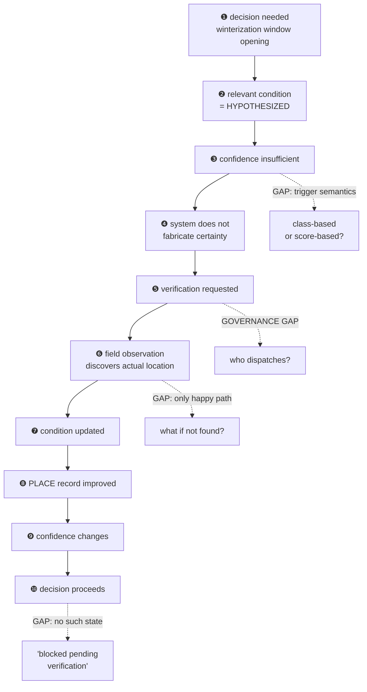
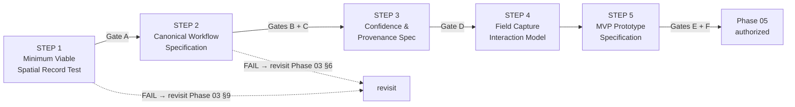

# 03 — Phase 03 Critical Evaluation & Phase 04 Plan

## Whitetail Club & Shore Lodge — Stewardship Intelligence System

**Purpose:** Critically evaluate the Phase 03 information architecture on its own terms — not as a formality before Phase 04, but as the thing that determines whether Phase 04 is even the right next step. Then define Phase 04 from what that evaluation actually finds.
**Governed by:** [`00-project-governance.md`](00-project-governance.md) — binding.
**Evaluates:** [`02-information-architecture.md`](02-information-architecture.md) (Phase 03), against [`01-system-model.md`](01-system-model.md) (Phase 02).
**Evidence tags** per governance §4. **No claim here is `[VF]`** — all primaries remain unheld. Architectural findings below are the author's own critical re-reading of a prior deliverable, tagged `[RSI]` unless otherwise noted, not new research.

**A note on method.** I wrote Phase 03. This document is not a fresh reviewer's first impression — it is the closest thing available to an adversarial re-read by the same author, which has a specific weakness: I am the person least likely to notice my own blind spots. Where a finding below reads as self-critical, that is deliberate; where the evaluation validates a Phase 03 decision, it is because re-testing it against the specific failure mode did not break it, not because revisiting felt unnecessary.

---

# PART 1 — Critical evaluation of Phase 03

Five classifications, applied without inflation: **RESOLVED** · **WELL-SUPPORTED BUT NEEDS VALIDATION** · **DESIGN HYPOTHESIS** · **OPEN QUESTION** · **ARCHITECTURAL RISK**.

## 1.1 — PLACE

**The decision:** collapse domain / zone / surface / segment / feature into one recursive `PLACE { geometry: point|line|area, regime, parent }`.

**What it solves — genuinely.** One addressing spine instead of five typed entities means one containment rule, one query pattern at any scale, and no decision about which of five tables a new physical thing belongs in. `regime` correctly absorbed the distinction that mattered (greens, native areas, and shoreline fail differently) without reifying it as a structural type — that collapse is **RESOLVED** and I would not reopen it.

**What it introduces.** Recursion is not free. Three things need naming precisely because Phase 03 elided them:

- **`regime` is modeled as a static attribute, and it is not one.** The research corpus, already in the register, contains a direct counterexample: *"dry-back"* `[SRC]` — deliberately reducing irrigated turf acreage to stay under the 89-acre legal cap — is literally a decision to change what a surface *is being stewarded as*, not merely its condition. Phase 03's `CONDITION` object would happily record "this area is currently dry-backed," but the `PLACE.regime` attribute as specified has no notion of changing over time. This is not a hypothetical edge case; it is named, sourced evidence the architecture does not yet account for. **Classification: OPEN QUESTION**, and a real one — not filed under "future," because dry-back is a *current-practice* fact `[SRC]`, not a speculative one.
- **A line-place crossing multiple zones gets one arbitrary administrative parent.** Phase 03 admitted this in prose (§9.1: *"containment is administrative, not strictly geometric"*) without working through the consequence: a "show me everything in this zone" roll-up query will silently miss the portion of a drainage line that physically passes through it but is parented elsewhere. **Classification: ARCHITECTURAL RISK**, minor, already partly self-disclosed.
- **Whether the abstraction survives contact with an actual user was never tested, and Phase 03 did not claim it was.** "Point, line, area; regime; recursive parent" is a coherent data model. Nobody has checked whether it can be *presented* in a way that still feels like "the 9th green" rather than "area-place, regime = turf-putting, parent = zone 4." This is not a flaw in the model — it is a claim the model has not yet earned the right to make. **Classification: OPEN QUESTION**, and the highest-consequence one in this section, because if the abstraction cannot be hidden behind ordinary language, every downstream capability inherits the cost.

**Verdict:** keep recursive PLACE. It is the right structural call. What is missing is not a redesign — it is an explicit position on regime mutability, and an honest acknowledgment that "understandable to a superintendent" is asserted, not demonstrated.

## 1.2 — CONTEXT

**The decision:** CONTEXT is a computed view, assembled fresh at decision time from season state, open windows, recent events, and knowledge — never stored.

**Does this protect freshness?** Yes, and cleanly, for exactly one of the three things the brief asked me to distinguish. Let me actually distinguish them, which Phase 03 did not do explicitly:

| | Live decision context | Historical decision context | Audit record |
|---|---|---|---|
| **Question it answers** | *What should inform this choice right now* | *What was true at the place, at that past moment* | *What did the decision-maker actually see when they decided* |
| **Freshness requirement** | Must be current | Must be reconstructable as-of a date | Must be exactly what was shown, unchanging |
| **Phase 03 coverage** | **Handled** — this is what "computed, never stored" is for | **Partially handled** — condition history and event records are timestamped, so in principle "as-of" queries are possible | **Not handled** |

**The gap, specifically.** `DECISION.evidence_basis` (§5.5) snapshots the *confidence* its inputs carried — a number, effectively — but not the full context that was assembled: which windows were open, which knowledge records were surfaced, what the supervisor actually saw. If a `KNOWLEDGE RECORD` is later revised — and Phase 02's own open question **A1** left the supersession mechanism for knowledge records undefined — then reconstructing "what did we know at decision-time X" by re-running today's context computation against yesterday's timestamp would silently return *today's* corrected knowledge, not what was actually shown. **A historical query answered with live logic gives a wrong answer that looks like a right one**, which is worse than no answer.

**Classification: WELL-SUPPORTED BUT NEEDS VALIDATION** for the live case; **OPEN QUESTION**, directly inherited from Phase 02's A1, for the audit case. Not an argument for storing full context — that reintroduces the staleness problem this decision exists to avoid. The fix, if one is needed, is narrower: either knowledge records need versioning (so "as-of" queries are actually sound) or `evidence_basis` needs to widen from "confidence snapshot" to "context snapshot." Which is a Phase 04 decision, not a Phase 03 amendment made here.

## 1.3 — CONFIDENCE

**The decision:** `CONFIDENCE = provenance_ceiling × recency_factor(decay_profile) × contest_penalty` — computed on read, never stored.

**Does it deliver freshness, explainability, provenance, temporal behavior?** Freshness and provenance: yes, structurally, by construction. Explainability: yes *in principle* — every input is inspectable, which is the right property to have designed for. But "inspectable in principle" and "actually specified" are different claims, and the second one is where this breaks down.

**Forcing the question the brief asked — what causes confidence to change:**

| Direction | Mechanism specified? |
|---|---|
| **Increase** | Yes — a new, stronger observation (verification) supersedes the prior dominant one. §6 is concrete here. |
| **Decrease** | Partially — "recency factor against a type's decay profile" is asserted, but **`decay_profile` is never given a functional form.** Linear decline? Threshold bands (fresh / aging / stale)? Half-life? The document names the concept and stops. |
| **Remain unchanged** | Implicit only — presumably nothing changes absent new evidence or elapsed time, but this is inferred, not stated. |
| **Suppressed** | Named (`CONTESTED`) but **the contradiction-detection rule does not exist.** Two moisture readings differing by a small margin is not the same fact as "clear" vs. "blocked," and nothing in the document says how the system tells ordinary variation from actual disagreement. |

**Classification: DESIGN HYPOTHESIS, correctly shaped, materially under-specified.** Both gaps matter for different reasons: the decay-profile form determines whether confidence is *communicated* as a number, a band, or a qualitative state — a real interaction-design fork, not a detail. The contradiction rule determines how often `CONTESTED` fires at all — too loose and everything looks uncertain; too strict and real disagreement gets missed. Neither gap should be closed by invention here; both are exactly the kind of thing that needs one worked example before being decided in the abstract, which is why they route to Phase 04 Step 3 rather than being resolved in this document.

## 1.4 — TASK / OBSERVATION / VERIFICATION

Testing each case the brief specified against the actual document, not against what I intended it to say:

| Case | Status |
|---|---|
| **ACT** | Handled — `TASK.purpose = ACT → ACTION → OBSERVATION`. |
| **VERIFY** | Handled — the entire §6 mechanism. |
| **INSPECT** | **Not handled.** The enum value exists (§3.1, §6.2) and is never defined again anywhere in the document. Is it a scheduled, no-specific-trigger routine check (distinct from VERIFY's confidence-triggered dispatch)? As written, it is a third value with no behavior attached to it. **ARCHITECTURAL RISK — self-inflicted**, and the cleanest one to name, because it is not a subtle gap; it is an unused variable. |
| **Observation without a task** | **Structurally fine, never stated.** The §10 relationship graph already carries a direct `PLACE → OBSERVATION` edge independent of `ACTION`, which is exactly what a spontaneous D6-style find requires. But the prose never says this explicitly, and — more consequentially — **the graph has no path from `OBSERVATION` back to a new `TASK`.** D6 explicitly ends in "proceed / handle / **escalate**," and escalation is presumably a new dispatched task. That relationship does not exist in the model as documented. **Classification: RESOLVED in structure, ARCHITECTURAL RISK in that a real relationship is missing from the diagram.** |
| **Verification of a condition** | Handled, §6.3. |
| **Discovery of a genuinely new condition** (at a place not yet in the record at all) | **Unresolved, and it connects directly to Part 3.** If every `OBSERVATION` must reference an existing `PLACE`, field discovery of something never recorded has no entry point. Not fixed here — this is A2's actual substance. |
| **Contradictory observations** | Named (§4.3) but see 1.3 — the detection rule is missing. |
| **Repeated / failed verification** | **Not modeled.** §6.3's diagram is the happy path only: dispatch → look → find → confidence up. There is no state for "looked, could not confirm" or "looked, confirmed the thing is *not* where the record says." **ARCHITECTURAL RISK**, and the one that matters most for Part 2 below. |
| **Verification of spatial location itself** | Handled — §5.5 and §6.3's dotted "location upgraded" path. |
| **Verification changing the PLACE record** | Handled for the *confirming* case. Not handled for the *disconfirming* case — see above. The current four-value location-provenance enum (SURVEYED / CONFIRMED / INFERRED / HYPOTHESIZED) has no "searched, not found" state, so a failed search currently has nowhere to go except silently remaining `HYPOTHESIZED` forever, indistinguishable from "never checked." |

**Overall verdict on §6's mechanism:** the *shape* — one attribute plus one relationship, no new object — is right and should not be reopened. What is missing is not more structure; it is **two more values in existing enums** (a defined `INSPECT`, and a "verification inconclusive/negative" outcome) and **one more relationship** (`OBSERVATION → generates → TASK`, for escalation). All three are extensions within the existing discipline, not violations of it.

## 1.5 — The defining loop, against CMMS / GIS / inspection / work-order / asset / field-service

The claimed loop is `PLACE → CONDITION → CONFIDENCE → DECISION → TASK → OBSERVATION → CONDITION`. Tested against each category on behavior, not language:

| Category | What it actually does with uncertainty | Why the loop differs |
|---|---|---|
| **CMMS** | Treats recorded asset state as authoritative once entered; "inspection" is scheduled, not confidence-triggered | No native concept of *provenance class* on state, and no mechanism connecting low confidence on a *pending decision* to dispatched work |
| **GIS** | Geometry-first, authoritative; analysis and topology are the product | Explicitly rejected by Phase 03 §9.3 — opposite orientation. This system does not compete with GIS; it is the thing GIS does not do. |
| **Inspection software** | Checklist-driven, scheduled or routine capture against known assets | Closest analog. Missing: the OBSERVATION/CONDITION split with derivation; and inspections are *scheduled*, not *generated because a specific pending decision needs them* |
| **Work-order software** | Transactional, task-lifecycle-centered; the work order is the record | No persistent place-level condition *history* as a first-class citizen — the record is the ticket, not the place |
| **Asset management** | Lifecycle-focused: depreciation, maintenance schedules, replacement | No modeling of "how confidently is this known," and no decision-support role — it manages the thing, not the judgment about the thing |
| **Field service** | Dispatch-centered: routing, SLAs, parts | Transactional per job; no accumulating place-level knowledge that returns as context on future work |

**The honest distinction, stated behaviorally:** in every category above, uncertainty is either absent from the data model entirely or expressed passively — a flag, a confidence score sitting in a column nobody consults. **None of them have a mechanism where low confidence on an irreversible pending decision automatically becomes dispatchable field work, whose result then upgrades both the interpretation and the underlying spatial record.** That is confidence with consequences, not confidence as a report.

**The honesty check the brief demands.** This is an architectural and behavioral claim derived from how the six categories are typically structured — it is **not** a market survey, and none exists. I have not verified that no product anywhere combines these mechanisms; the stop-rule (governance §3) explicitly forbids researching this just to firm up a differentiation claim, since nothing about the system model would change either way. **Classification: DESIGN HYPOTHESIS.** The case study may argue this behavioral distinction; it may not assert market uniqueness as fact.

## 1.6 — C2 Field Capture and C4 Verification

**Are they genuine architectural consequences, or renamed features?**

**C4 (Verification) is a genuine emergence.** It required an actual new mechanism — `TASK.purpose` and `OBSERVATION.verifies`, neither of which existed before the model was traced end-to-end and confidence's only-downward-decay problem surfaced. This is architecture producing a capability the research never named.

**C2 (Field Capture) is not the same kind of thing, and Phase 03 overstated it.** Re-checking §13.2's own justification: C2's information requirement is *"observation + a completion-gesture UX pattern."* That is not a new mechanism — it is the pre-existing `OBSERVATION` object, elevated to named-capability status because tracing the model revealed **how totally everything else depends on it** (§8.3's own finding: if capture fails, the whole system silently degrades). That is a legitimate and useful discovery — surfacing a hidden critical dependency is real work — but it is a *different kind* of emergence than C4's. Conflating "we found a load-bearing dependency" with "the architecture required a new mechanism" slightly inflates the claim.

**Is this a strength of the methodology?** Yes, with that correction. The chain `SYSTEM REQUIREMENT → INFORMATION REQUIREMENT → DECISION → WORKFLOW → CAPABILITY` did what it was for: it let two capabilities absent from the original research surface on their own merits, and it did so through two genuinely different mechanisms (a new relationship, and a dependency audit) rather than one. **Classification: RESOLVED**, with the C2/C4 distinction now stated precisely rather than glossed.

---

# PART 2 — Pressure-testing the Uncertain Valve

The signature workflow (Phase 03 §15) is the architecture's own stress test: if it walks cleanly, the model holds. Walked step by step against the document as written — **identifying gaps only, not fixing them.**

| Step | Supported? | Gap identified |
|---|---|---|
| **❶ A decision needs to be made** | **Yes** | `WINDOW` with trigger and closing condition covers this cleanly. |
| **❷ Condition is HYPOTHESIZED** | **Yes** | §5.3 explicitly permits hypothesized conditions to exist — deliberate and correct. |
| **❸ Confidence is insufficient** | **Ambiguous** | **Semantic collision.** Phase 02 §9.4 states the escalation rule in *provenance-class* terms (`INFERRED`/`HYPOTHESIZED` × irreversible). Phase 03 §5.4 models confidence as a *continuous computed function*. Is the trigger a class test or a threshold test on a score? These give different answers at the margin, and the documents never reconcile them. |
| **❹ System does not fabricate certainty** | **Yes** | The strongest step. Governance §5 G2/G4 plus the provenance model make fabrication structurally difficult, not merely discouraged. |
| **❺ System requests verification** | **Yes, but governance-risky as worded** | §6.4's phrasing — *"the system's correct output is a verification task"* — reads as the system autonomously generating and issuing work. Governance §5 and Phase 02 §10 require every loop to close through a human decision, and D3's own text says *"system proposes, person approves."* **§6 does not carry that framing forward consistently.** This is a wording-and-semantics gap with real governance weight, not a mechanism gap. |
| **❻ Field observation discovers actual location** | **Partially** | Works when the valve is *found*. **No modeled outcome for "searched, could not confirm"** or **"confirmed absent / not as recorded."** Both are realistic outcomes when as-builts are known-incomplete `[SRC]` — arguably *the most likely* outcomes in early use. |
| **❼ Condition updated** | **Yes** | §4.2 derivation handles this. |
| **❽ PLACE record improved** | **Yes for confirmation; no for disconfirmation** | The location-provenance enum has no "searched, not found" value, so a failed search leaves the record indistinguishable from "never checked" — and the next cycle will dispatch someone to look again, with no memory that the last search failed. **This is the sharpest single gap in the walk.** |
| **❾ Confidence changes** | **Yes upward; undefined for a null result** | If verification returns nothing, does confidence stay flat, drop (we looked and could not find it), or become contested? Nothing specifies this. |
| **❿ Decision proceeds** | **Structurally, yes — but no explicit state** | There is no "decision blocked pending verification" state. Likely none is needed — the open `WINDOW` plus `CONDITION.status` probably already carry the signal — but Phase 03 never says so, making this a **silent gap rather than a documented design choice.** |

### 2.1 — What the walk actually reveals

**Six of ten steps are clean.** The four that are not cluster tightly, and that clustering is the real finding:

> **The architecture models verification succeeding. It does not model verification failing.**

Steps ❻, ❽, and ❾ are one gap wearing three hats. And it is not an exotic edge case — when the source problem is *incomplete as-built documentation* `[SRC]`, "went to look, could not find it" is a **routine** outcome, plausibly the majority outcome in early operation. A verification loop that only handles success would, in practice, repeatedly re-dispatch crews to search for things nobody could find last time — **actively worse than no system**, because it manufactures wasted field trips and quietly discards the one genuinely valuable finding (this record is wrong).

**UX implications** *(identified, not designed)*: a failed search needs to be as fast and dignified to record as a successful one, or crews will simply not close the loop — which folds directly into Phase 02 R1 (capture never happens). **Governance implications**: the ❺ wording must be tightened so the system is unambiguously surfacing a gap for a human to act on, never dispatching autonomously.

---

# PART 3 — A2: the minimum viable spatial record

Phase 03 named A2 the largest open question and the largest risk to the concept's practical justification. Working it directly.

### 3.1 — The risk, stated precisely

> If the system requires a complete digitized landscape before it becomes useful, it cannot justify itself — the digitization project would cost more than the problem it solves, and no organization with incomplete as-builts `[SRC]` is positioned to fund one.

### 3.2 — The resolution

**The architecture's own verification loop is the digitization mechanism.** This is not a workaround; it is what §6.4 and P8 already claim, applied to the bootstrap problem:

- A `PLACE` may exist with **no coordinates at all** — location provenance `HYPOTHESIZED`, or even "described, not located."
- Conditions attach to it regardless (§5.3 permits hypothesized conditions).
- Field work upgrades location provenance as a byproduct (P8, §9.5).
- **Therefore the spatial record is an output of using the system, not a precondition for using it.**

**There is no digitization phase.** The system starts approximately right and becomes precisely right through work that was already happening. That is the answer to A2, and it inverts the risk: incomplete as-builts are not an obstacle to adoption — **they are the initial dataset**, entered honestly at the provenance class they deserve.

### 3.3 — Minimum viable PLACE, by requirement

| Requirement | **Absolutely required** | **Useful but optional** | **Derived** | **Historical** | **Future `[SC]`** |
|---|---|---|---|---|---|
| **A PLACE to exist** | name · parent (may be domain-level) · regime · location-provenance tag | coordinates, extent, geometry detail | full ancestry path | prior names | survey-grade geometry, GIS import |
| **A PLACE to support a CONDITION** | existence only | — | — | — | — |
| **A CONDITION to support a DECISION** | ≥1 supporting observation · condition type · provenance class | multiple corroborating observations | confidence, status | condition series | — |
| **A TASK dispatched to a PLACE** | place reference · **human-readable location description** | coordinates for navigation | — | — | turn-by-turn routing |
| **An OBSERVATION to update the system** | place ref (may be coarse) · timestamp · role · content · provenance class | photo, instrument reading | — | — | automated capture |
| **A verification to improve confidence** | `verifies →` link · outcome | location upgrade if a feature was found | recomputed confidence | verification history | — |

**The load-bearing line in that table** is *human-readable location description* under TASK dispatch. Phase 03 §9.2 claimed **"verification sets the floor — 'go look' needs somewhere specific to stand,"** and implied that floor was spatial precision. **On re-examination, that is wrong.** "The valve on the north side of the 4th green, roughly four metres off the cart path" is entirely sufficient to dispatch a person. **The floor is describability, not coordinates** — which is materially lower than Phase 03 assumed, and is the single most important finding in this section.

### 3.4 — Two problems surfaced by working A2

**The orphan-condition collision.** Phase 03 §4.2 rule 1 states *"no orphan conditions — a condition must cite its supporting observations."* But the existing partial as-builts `[SRC]` are precisely how initial place data would enter the system, and **nobody observed a decades-old drawing.** As written, legacy import either violates the rule or requires an exception carved into it.

*Directional lean, for Phase 04 to decide:* treat an imported legacy record as a `REPORTED`-class pseudo-observation (role: "imported record," timestamp: import or document date). This **preserves the no-orphan rule rather than puncturing it**, keeps provenance honest, and makes the drawing's authority visible and challengeable exactly like any other reported source. Not decided here.

**"Expect to search" may be the norm, not the exception.** Phase 03 §9.4 frames `INFERRED`/`HYPOTHESIZED` location as an occasional caveat. If the MVP bootstraps from incomplete as-builts, **most places will start there** — and combined with Part 2's finding that failed verification is unmodeled, early operation could consist substantially of crews searching for things and having no good way to record not finding them. **Architecturally acceptable; empirically untested; genuinely concerning.** Routed to Phase 04 Steps 1 and 4.

---

# PART 4 — The Minimum Viable Stewardship System

Moving from spatial record to whole system. **The objective is the smallest system that proves the concept**, not a reduced version of a complete one.

| Dimension | Minimum |
|---|---|
| **Minimum data** | One domain · a handful of places at mixed location-provenance · one condition type with a decay profile · a small observation history · one open window |
| **Minimum interaction** | Four: see what is known about a place · capture an observation · dispatch and receive a verification · record a decision with rationale |
| **Minimum spatial representation** | **Name + parent + describable location.** No coordinates required (§3.3). |
| **Minimum provenance** | The five classes, with a *coarse* recency treatment. Band-level ("fresh / aging / stale") is sufficient to prove the mechanism; a precise decay function is not needed to demonstrate the behavior. |
| **Minimum decision logic** | One rule: **low confidence × irreversible → surface a verification gap to a human.** Nothing else. |
| **Minimum field capture** | Place reference · timestamp · role · one photo or one short note · provenance class. Under the P3 seconds-budget. |
| **Minimum verification mechanism** | `TASK.purpose = VERIFY` · resulting observation links to the condition · **outcome recorded including a null result** (Part 2). |
| **What can remain unknown** | Precise coordinates · full place inventory · exact decay rates · every condition type · Shore Lodge operational depth · all decisions except D3 |
| **What can be manually entered** | Everything. **The MVP requires zero integrations** — Phase 03 §12.3's design property becomes the MVP's practical enabler. |
| **What can be inferred** | Condition state from elapsed time + related conditions, **provided it is labeled `INFERRED`** and never silently promoted (governance G1). |
| **What must never be fabricated** | Sensor readings · measurements nobody took · coordinates presented as surveyed · confidence not derived from real evidence · any condition without a traceable supporting observation · environmental damage, regulatory violation, or organizational behavior (governance G5/G7/G8) |

### 4.1 — Which decisions the MVP must carry

Phase 03 §16.3 chose **D2 (frost delay) + D3 (winterization sequencing)** without fully stating why that pair. Re-testing it produces a sharper and partly different answer:

> **D2 alone cannot demonstrate the differentiator.** Its condition is `MEASURED`, minutes old, high confidence — there is no confidence gap for verification to close. D2 exercises the fast loop and the slow loop's *return* (historical thaw lag), but never the verification mechanism.
>
> **D3 is therefore non-negotiable.** It is the only modeled decision where low-confidence evidence meets an irreversible choice — which is the entire product claim.

**D2 remains valuable** as the sharpest demonstration of slow-loop return into a fast-loop moment, and as proof the system handles the *high*-confidence case without ceremony. But if the MVP had to carry one decision, it is D3. That is a correction to Phase 03's implicit framing, which presented the pair as equally weighted.

---

# PART 5 — What Phase 04 must not become

Each drift risk paired with the **guardrail that already exists** in Phase 02/03 — these are not new constraints, they are existing decisions doing load-bearing work.

| Drift risk | Existing architectural guardrail |
|---|---|
| **GIS digitization exercise** | Part 3: coordinates are optional; **describability is the floor.** A place with a name and a parent is a valid place. Phase 03 §9.3 already rejects analysis and topology as out of scope. |
| **Generic CMMS** | `PLACE` is the root object, not `ASSET` — and "asset" was explicitly rejected (§3.3) for importing lifecycle framing. Conditions attach to *places*, not equipment. |
| **Generic work-order application** | **`TASK` is the only transient object** (§3.1). It is architecturally designed to disappear. Phase 03 §7.4's own removal test names the failure mode: a fast-loop-only system "feels complete while accumulating nothing." |
| **Asset inventory project** | The system's output is *decisions and knowledge*, not a register. Completeness of inventory is explicitly listed under "what can remain unknown" (§4). |
| **Dashboard-design exercise** | §14.4 rejected a general status overview: `ATTENTION` answers *"what needs me,"* never *"how are things."* Phase 02 established only D3/D7 are cross-place — the sole justification for any property-wide view. |
| **AI assistant concept** | The confidence function is **fully inspectable by construction** (§5.4) — the system must always explain *why* it is uncertain. A black-box score would violate the explainability property the architecture is built on. Plus governance G2/G4. |
| **Generic property-management platform** | Governance §12.2's exclusion list: buildings interiors, guest experience, financial systems, HR, compliance filing. All already outside. |
| **Giant data-model expansion** | **Eleven objects, and Part 1's findings are deliberately resolved as enum values and relationships, not new entities.** Working rule 4 (prefer relationships/attributes/computed views over new objects) is the standing discipline. |

> **The pattern worth noticing:** every guardrail above is a decision already made and already documented. Phase 04 does not need new constraints — it needs to not quietly abandon existing ones under implementation pressure.

---

# PART 6 — The Phase 04 work plan

**Five steps.** Sequenced so that each resolves uncertainty the next one depends on, moving *architecture → minimum viable information → workflows → interaction model → prototype requirements*. **No visual design in any step** — Part 1.1 established that "understandable to a user" is unvalidated, and interaction structure must be settled before appearance.

### Step 1 — Minimum Viable Spatial Record Test

| | |
|---|---|
| **Objective** | Prove or disprove that D3 can be walked end-to-end with places carrying **no coordinates** — name, parent, regime, and a describable location only. |
| **Question answered** | Q1 and Q4 (Part 8). Does the loop trigger and resolve at minimum spatial richness? |
| **Inputs** | Phase 03 §9, §15; Part 3 of this document |
| **Method** | Paper walkthrough. Construct a deliberately impoverished place set — one domain, ~6 places at mixed provenance, most `HYPOTHESIZED` — and attempt the full Uncertain Valve sequence against it. **Record every point where the walkthrough reaches for information the minimum record does not have.** |
| **Artifact** | Minimum Viable Spatial Model *(spec + the worked walkthrough that tested it)* |
| **Decision gate** | **GATE A** |
| **Revisit Phase 03 if** | The walkthrough cannot proceed without coordinates → Phase 03 §9.2's resolution claims are wrong and the spatial model needs rework. **This is the single most likely trigger for revisiting Phase 03**, which is why it is Step 1. |

### Step 2 — Canonical Workflow Specification

| | |
|---|---|
| **Objective** | Specify the Uncertain Valve workflow completely, **including every failure path**, closing the four gaps Part 2 identified. |
| **Question answered** | Does the loop close without architectural workarounds, including when verification fails? |
| **Inputs** | Part 1.4, Part 2; Phase 03 §6, §15 |
| **Method** | Full state specification. Must resolve, **as enum values and relationships only — no new objects**: (a) define `INSPECT` or remove it; (b) add verification outcomes covering *confirmed*, *inconclusive*, and *confirmed-absent*; (c) add `OBSERVATION → generates → TASK` for D6 escalation; (d) restate §6.4 so verification is unambiguously **human-dispatched from a system-surfaced gap**; (e) decide whether "blocked pending verification" needs a state or is already carried by `WINDOW` + `CONDITION.status`. |
| **Artifact** | Canonical Workflow Specification |
| **Decision gate** | **GATES B and C** |
| **Revisit Phase 03 if** | Any gap cannot be closed within existing objects → §6's "one attribute, one relationship" claim was too economical. |

### Step 3 — Confidence & Provenance Specification

| | |
|---|---|
| **Objective** | Give the confidence function a specified functional form and a contradiction rule; resolve the live/historical/audit context distinction. |
| **Question answered** | Q3. Does a specified rule produce a decision-relevant signal rather than constant noise or constant silence? |
| **Inputs** | Part 1.2, 1.3; Phase 03 §4.3, §5 |
| **Method** | Specify decay as **bands, not a curve** (Part 4 established bands are sufficient to prove the mechanism, and bands are also more honestly communicable than a false-precision number). Define contradiction detection per condition type. Resolve the audit-context gap by choosing between knowledge-record versioning and widening `evidence_basis`. **Test against a worked example with real corpus-attested condition types** `[SRC]`. |
| **Artifact** | Confidence & Provenance Specification |
| **Decision gate** | **GATE D** |
| **Revisit Phase 03 if** | No band scheme produces a usable signal → confidence-as-computed-function may need to become something else. |

### Step 4 — Field Capture Interaction Model

| | |
|---|---|
| **Objective** | Establish that observation capture — including a **failed** verification — fits the P3 budget: seconds, one-handed, gloved, no navigation `[DH]`. |
| **Question answered** | Q2. Is "expect to search" tolerable at MVP frequency, and can a null result be recorded as easily as a positive one? |
| **Inputs** | Part 2.1, Part 3.4; Phase 03 §11.4, §13.1 (C2) |
| **Method** | Interaction structure only — **sequence, inputs, and decision points, not layout or visual design.** Specify the D6 knowledge return (one sentence to a gloved hand) and the capture path for all three verification outcomes. Count interaction steps against the budget. |
| **Artifact** | Field Capture & Knowledge Return Interaction Model |
| **Decision gate** | Contributes to **GATE F** |
| **Revisit Phase 03 if** | Capture cannot be structured within the budget → **the architecture changes, not the budget** (Phase 02 R1 is explicit that this dependency is total). |

### Step 5 — MVP Prototype Specification

| | |
|---|---|
| **Objective** | Synthesize Steps 1–4 into what Phase 05 needs to build a demonstrable prototype. |
| **Question answered** | Is there a system small enough to prototype without data migration, that still demonstrates the thesis? |
| **Inputs** | All prior steps; Phase 03 §16 |
| **Method** | Define the MVP as **D3 primary, D2 secondary** (Part 4.1), with its data seed, capability subset, and the specific demonstration sequence. State explicitly what is excluded. |
| **Artifact** | MVP Prototype Specification |
| **Decision gate** | **GATES E and F** |
| **Revisit Phase 03 if** | The minimum system cannot demonstrate behavioral distinction from a work-order tool → the defining loop is not as defining as claimed. |

---

# PART 7 — Phase 04 gates

Each gate is falsifiable. **"PASS" requires the stated evidence, not a judgment that it seems fine.**

### GATE A — Spatial Sufficiency
> *Can the system function without a complete digitized landscape?*

| | |
|---|---|
| **PASS** | The Step 1 walkthrough completes D3 end-to-end using only name, parent, regime, and describable location. Every place lacking coordinates still supports conditions, dispatch, and verification. |
| **FAIL** | The walkthrough stalls at any step requiring coordinates or geometry the minimum record cannot supply. |
| **On FAIL** | Revisit Phase 03 §9. The concept's practical justification is in question — this is the gate that most threatens the project. |

### GATE B — Loop Sufficiency
> *Can one real scenario traverse `PLACE → CONDITION → CONFIDENCE → DECISION → TASK → OBSERVATION → CONDITION` without architectural workarounds?*

| | |
|---|---|
| **PASS** | The full Uncertain Valve sequence specifies cleanly, **including all three verification outcomes**, using only existing objects plus new enum values and relationships. |
| **FAIL** | Any step requires a new object type, or a gap is closed by special-casing rather than by the general model. |
| **On FAIL** | Revisit Phase 03 §6. |

### GATE C — Verification Sufficiency
> *Can verification genuinely improve both knowledge and spatial accuracy?*

| | |
|---|---|
| **PASS** | A verification observation demonstrably (a) raises condition confidence, (b) upgrades location provenance when a feature is found, **and (c) records a useful, non-repeating result when it is not found.** |
| **FAIL** | Only the success path works — i.e. a failed search leaves the record indistinguishable from "never checked," causing repeat dispatch. |
| **On FAIL** | The verification loop as specified is worse than no system in the case that matters most `[RSI]`. Blocking. |

### GATE D — Provenance Sufficiency
> *Can the system explain why it believes something?*

| | |
|---|---|
| **PASS** | For any condition, the system can state its provenance class, its supporting observations, its recency band, its contest status, and how each contributed — **in language a superintendent would use**, not as a score. |
| **FAIL** | Explanation requires exposing the formula, or reduces to an unexplained number. |
| **On FAIL** | Revisit Phase 03 §5. The signature property does not survive without this. |

### GATE E — Product Distinction
> *Can the resulting system be distinguished behaviorally from a work-order or GIS system?*

| | |
|---|---|
| **PASS** | A specific behavior exists that neither category performs: **low confidence on an irreversible pending decision surfaces a verification gap, whose resolution upgrades both interpretation and spatial record.** Demonstrable in the MVP sequence. |
| **FAIL** | The distinction can only be articulated in language, not demonstrated in behavior. |
| **Constraint** | This is an **architectural/behavioral claim, tagged `[DH]`** (Part 1.5). Passing this gate does **not** license a market-uniqueness claim in the case study. No market research exists, and the stop-rule forbids conducting it. |

### GATE F — MVP Sufficiency
> *Is there a small enough system to prototype without massive data migration?*

| | |
|---|---|
| **PASS** | The MVP spec requires **zero integrations**, a hand-entered seed dataset of roughly one domain and under a dozen places, and still walks the full demonstration sequence. |
| **FAIL** | Any bulk import, integration, or digitization effort is required before the demonstration works. |
| **On FAIL** | Reduce scope further before proceeding; do not proceed to Phase 05. |

---

# PART 8 — The single most important Phase 04 question

> # Can the defining loop be walked completely — including when verification fails — using only a spatial record that requires no digitization?

**Why this one.** Every other uncertainty is survivable. If confidence bands are miscalibrated, they get tuned. If capture interaction is clumsy, it gets redesigned. **If the answer to this question is no, the product has no practical justification** — it becomes a system that requires a GIS project to deliver value, which no organization with incomplete as-builts is positioned to fund `[RSI]`. It subsumes Gates A, B, and F, and it is where Parts 1, 2, and 3 all converge: Part 1 found the model under-specifies failure, Part 2 found the failure path unmodeled, Part 3 found the spatial floor is lower than assumed. **All three meet here.**

The failure clause is not decorative. Part 2.1 established that with incomplete as-builts, *failed* verification is plausibly the majority early outcome — so a loop that only closes on success does not actually close.

### Supporting questions

| # | Question | Resolved by | Addresses |
|---|---|---|---|
| **Q1** | Does D3 and its verification sub-loop trigger and resolve with only name, parent, regime, and a describable location? | Step 1 | Part 3.3 — the describability-not-coordinates finding |
| **Q2** | Is "expect to search" tolerable at the frequency an MVP would actually produce, and can a null result be captured within the P3 budget? | Steps 1, 4 | Part 2.1, Part 3.4 |
| **Q3** | Does a banded decay + contradiction rule produce a decision-relevant signal rather than constant noise or constant silence? | Step 3 | Part 1.3 |
| **Q4** | Can a legacy as-built enter the system as a condition without violating "no orphan conditions"? | Step 1 | Part 3.4 |

---

# PART 9 — Recommended Phase 04 artifacts

**Five. One per step.** Each justified by the uncertainty it removes — an artifact that does not reduce uncertainty should not be produced.

| Artifact | Why it must exist |
|---|---|
| **Minimum Viable Spatial Model** | **The only artifact that can answer the primary question.** Without it, the concept's practical justification is unresolved and every downstream design decision rests on an untested assumption. |
| **Canonical Workflow Specification** | Part 2 found the signature workflow — the case study's centrepiece — **specified only for success.** A centrepiece with an unmodeled failure path cannot be presented, let alone prototyped. |
| **Confidence & Provenance Specification** | The signature property is currently a formula shape with two undefined inputs. Gate D cannot be assessed against a formula that does not specify what makes confidence decrease or become suppressed. |
| **Field Capture & Knowledge Return Interaction Model** | Phase 02 R1 identifies capture failure as the **highest-probability system failure**. The dependency is total; leaving it unspecified into a visual phase means designing appearance for an interaction that may not fit its budget. |
| **MVP Prototype Specification** | Gates E and F are unassessable without a defined minimum system. It is also the handoff artifact Phase 05 requires. |

### Explicitly not recommended

| Not producing | Why |
|---|---|
| **Data schema** | Still implementation. Governance and every prior phase defer this; nothing in Phase 04 requires it. |
| **Screen inventory / wireframes** | Phase 05. Part 1.1 established the abstraction's user-legibility is unvalidated — designing screens before Step 4 would design appearance for an unproven interaction structure. |
| **Expanded entity model** | Working rule 4. Every Part 1 gap resolves as an enum value or relationship. **If Phase 04 produces new object types, something has gone wrong.** |
| **Stakeholder interviews / field research** | Would violate the governance §3 stop-rule. **Conditional exception:** if Gate A or C fails and the failure cannot be resolved on paper, real-world validation may become the only path — at which point it passes the stop-rule test legitimately (it would materially change the system model). Not the default, and not assumed. |
| **Competitive/market analysis** | Gate E is explicitly bounded as an architectural claim. Researching this to firm up differentiation would fail the stop-rule — nothing about the system model changes either way. |

---

# PART 10 — Phase 04 executive brief

## Phase 03 verdict

**Genuinely strong, and three things stand out.** The `PLACE` collapse is correct — one recursive addressing spine with geometry and regime as attributes is a better model than five typed entities, and re-testing did not break it. The `OBSERVATION`/`CONDITION` split (immutable testimony vs. revisable interpretation) is the decision that makes provenance representable at all; without it nothing else in the architecture works. And the discipline of resolving needs as attributes, relationships, and computed views rather than new objects held throughout — eleven objects for a system this rich is a real achievement, and every one of this document's findings resolves within that discipline rather than against it.

**The methodology also demonstrably worked**: two capabilities surfaced from the architecture rather than the research, via two genuinely different mechanisms (C4 a new relationship, C2 a discovered critical dependency — a distinction Phase 03 blurred and Part 1.6 corrects).

## What remains uncertain

Only the highest-value items:

1. **The spatial floor is untested** — Part 3 argues it is *describability*, not coordinates, which is materially lower than Phase 03 assumed. Unproven.
2. **Verification failure is unmodeled** — and with incomplete as-builts, failure is plausibly the *common* case. A loop that only closes on success does not close.
3. **Confidence has two undefined inputs** — no decay form, no contradiction rule.
4. **Two smaller self-inflicted gaps** — `INSPECT` defined nowhere; no `OBSERVATION → TASK` relationship for D6 escalation.
5. **Governance wording risk** — §6.4 reads as the system autonomously dispatching work.

## Primary Phase 04 objective

> Establish that the defining loop can be walked completely, including its failure paths, on a spatial record that requires no digitization — and specify the minimum system that demonstrates it.

## Primary question

> Can the defining loop be walked completely — including when verification fails — using only a spatial record that requires no digitization?

## Secondary questions

1. Does D3 and its verification sub-loop resolve with only name, parent, regime, and describable location?
2. Is "expect to search" tolerable at MVP frequency, and can a null result be captured within the P3 budget?
3. Does a banded decay + contradiction rule produce a decision-relevant signal?
4. Can a legacy as-built enter as a condition without violating "no orphan conditions"?

## Phase 04 sequence

1. **Minimum Viable Spatial Record Test** → Gate A
2. **Canonical Workflow Specification** → Gates B, C
3. **Confidence & Provenance Specification** → Gate D
4. **Field Capture Interaction Model** → contributes to Gate F
5. **MVP Prototype Specification** → Gates E, F

## Phase 04 gates

**A** Spatial Sufficiency · **B** Loop Sufficiency · **C** Verification Sufficiency · **D** Provenance Sufficiency · **E** Product Distinction *(architectural claim only)* · **F** MVP Sufficiency. Pass/fail criteria in [Part 7](#part-7--phase-04-gates). **Gate A is the one that threatens the project; Gate C is the one most likely to fail on first attempt.**

## Final deliverables

The five artifacts in [Part 9](#part-9--recommended-phase-04-artifacts). Nothing else.

## What we should NOT do yet

Visual design of any kind · screens, wireframes, or component definition · production data schemas · technology or platform selection · **any new object types** · stakeholder or field research *(unless Gate A or C fails and paper resolution proves impossible)* · competitive analysis · expansion beyond D3 primary and D2 secondary · Shore Lodge operational depth beyond what evidence supports.

---

## One closing observation on this evaluation

The most useful finding in this document was not a flaw in the model — it was a **claim the model made too confidently.** Phase 03 §9.2 asserted *"verification sets the floor — 'go look' needs somewhere specific to stand,"* and I wrote that believing it implied spatial precision. Re-reading it against the actual requirement showed the opposite: a person can be dispatched with a sentence. **The floor was lower than the document claimed, and lowering it removes the largest practical objection to the entire concept.**

That is worth noting as a pattern rather than a one-off: **the risk in a self-authored architecture is not usually a broken mechanism — it is an unexamined assumption stated with the same confidence as a tested one.** The evidence-tier discipline this project already runs on internal claims (governance §4) exists precisely to catch that, and Part 1 is an argument for applying it to architectural claims as rigorously as it is applied to research claims.

---

*Phase 03 evaluation complete. No architecture was modified, no objects added, no UI designed — by design. Next: Phase 04, Step 1 (§Part 6).*
