# 04 — Architectural Proof

## Whitetail Club & Shore Lodge — Stewardship Intelligence System · Phase 04

**Purpose:** Determine whether the defining loop survives its hardest case — verification failure on a spatial record that requires no prior digitization — before any product or interface design begins.
**Governed by:** [`00-project-governance.md`](00-project-governance.md) — binding.
**Under test:** [`02-information-architecture.md`](02-information-architecture.md) (Phase 03). **Not modified by this document.** Required changes are specified in [§11](#11--architecture-changes-required), not applied.
**Evidence tags** per governance §4. No claim here is `[VF]`. Architectural findings are `[RSI]`.

> ### Amendment note — v1.1 · authorized 2026-08-21
>
> **§11 row 6 amended.** The `OBSERVATION.outcome` enum now lists **five** values; `absent-at-described-location` was added.
>
> **Reason.** §4.A (the *cannot find* walkthrough) and §4.1 (this phase's own five-outcome summary table) **both already used** `absent-at-described-location`. The §11 change-list row listed only four values, under-listing its own body twice over. Resolved as **E1** in [`10-resolution-pass.md`](10-resolution-pass.md) §2. **This is a transcription correction, not a design decision** — no principle in any phase changes, and the amendment is representational rather than conceptual (`10-resolution-pass.md` §3).
>
> **Deliberately not changed.** §11's net-effect line — its arithmetic counts the enum's *introduction*, not its member count, and is unaffected. §4 and §4.1 already carried the value. **No object was added; the eleven-object claim in Phase 07 stands.**

**Hard tripwire, as instructed:** if resolving any gap requires a new object type, the proof stops and explains why the existing model fails before proposing one. **The tripwire did not fire.** All eight gaps and two additional defects resolve within the existing eleven objects.

---

## 1 — Proof objective

> **Can the defining loop be walked completely — including verification failure — using only a describable spatial record that requires no prior digitization?**

The proof must establish four things, and failing any one is a BLOCK:

1. The happy path traverses without architectural workarounds.
2. **All four verification-failure modes produce useful, permanent knowledge** — and never re-issue an identical task.
3. Every gap closes without a new object type.
4. A human can understand *why* the system considers a condition uncertain.

**What this proof deliberately does not do:** design interfaces, specify storage, claim market differentiation, or resolve anything requiring field data the governance §3 stop-rule forbids gathering.

---

## 2 — Architecture under test

### 2.1 Inherited position

| Element | Phase 03 position |
|---|---|
| Objects | Eleven. `PLACE` recursive, geometry-typed, regime-attributed |
| `OBSERVATION` | Immutable testimony; provenance-classed |
| `CONDITION` | Revisable interpretation derived from observations |
| `CONFIDENCE` | Computed: `provenance_ceiling × recency × contest_penalty` |
| Verification | `TASK.purpose ∈ {ACT, VERIFY, INSPECT}` + `OBSERVATION.verifies → CONDITION` |
| Spatial floor | **Describability, not coordinates** (Phase 04 evaluation, Part 3) |

### 2.2 Eight known gaps carried in

1. Verification failure has no modeled outcome · 2. `INSPECT` undefined · 3. No `OBSERVATION → TASK` · 4. Decay and contradiction rules undefined · 5. "System proposes, person approves" not consistently explicit · 6. C2/C4 emergence mischaracterized · 7. `regime` untested against change · 8. Escalation has no destination.

### 2.3 Two further defects found during this proof

Both verified against the document text, not recalled.

> **DEFECT 1 — Location is modeled twice, incompatibly.**
> §4.4's decay table lists **"Feature location"** as a **condition type** (*"Does not decay — a valve does not move"*). §5.5 and §9.4 model location as a **`PLACE` attribute** with its own separate four-value provenance enum (`SURVEYED / CONFIRMED / INFERRED / HYPOTHESIZED`). These are two incompatible representations of the same fact, and neither section acknowledges the other.

> **DEFECT 2 — A verification task's result cannot be recorded.**
> §10.1's relationship graph routes observations to tasks **only** via `TASK → ACTION → OBSERVATION`. But a `VERIFY` task produces **no `ACTION`** — §6.1 explicitly rejected modeling verification as an action because *"the landscape was not changed — someone looked."* Therefore **the graph has no path by which a verification task's finding returns to the system.**

**Defect 2 is the more serious of the two**, and larger than the known gap list stated. Gap 3 was framed as a missing escalation path — a D6 convenience. It is actually a **structural break in the defining loop itself**: the mechanism the entire product rests on cannot currently record its own output.

**Both are relationship- and attribute-level defects.** Neither requires a new object. Resolving Defect 1 turns out to close four of the eight gaps at once ([§4](#4--verification-failure-walkthroughs)).

---

## 3 — Happy-path walkthrough

The Uncertain Valve. Winterization approaching; one zone's drainage readiness rests on an incomplete as-built. **Every row assumes the [§11](#11--architecture-changes-required) changes.**

```mermaid
graph LR
    A["① condition<br/>ASSUMED"] --> B["② decision<br/>pending"]
    B --> C["③ gap<br/>surfaced"]
    C --> D["④ human<br/>approves"]
    D --> E["⑤ TASK<br/>VERIFY"]
    E --> F["⑥ field<br/>observation"]
    F --> G["⑦ conditions<br/>updated"]
    G --> H["⑧ location<br/>corrected"]
    H --> I["⑨ confidence<br/>CONFIRMED"]
    I --> J["⑩ decision<br/>proceeds"]
    J -.->|"rationale + evidence basis"| K["knowledge"]
```



### Step-by-step

**① Uncertain condition exists**
· **Object:** `CONDITION` (type `drainage-readiness`) · **Relationship:** anchored to `PLACE` (zone) · **State:** current · **Provenance:** `HYPOTHESIZED` — derived from an imported as-built, entered as a `REPORTED`-class pseudo-observation per the Phase 04 evaluation's orphan-condition resolution · **Actor:** none · **System:** derives condition, computes band `ASSUMED` · **Human decision:** none yet.

**② Decision becomes pending**
· **Objects:** `DECISION` (D3 sequencing), `WINDOW` (blowout point-of-no-return) · **Relationship:** `WINDOW bounds DECISION`; `CONDITION informs DECISION` · **State:** window open, closing · **Actor:** Superintendent · **System:** assembles context — season, open windows, last cycle's durations, per-zone readiness with bands · **Human decision:** *begins* the sequencing decision.

**③ Confidence gap surfaced**
· **State:** condition band `ASSUMED`; decision classified irreversible · **System behavior:** **surfaces the gap** — *"three zones rest on assumed readiness"* · **Human decision:** none yet.
> **This is where governance §5/§10 binds.** The system does **not** create or dispatch a task. It makes a gap visible. **Gap 5 closed by making this an explicit step rather than an implied one.**

**④ Human approves verification**
· **Actor:** Superintendent · **Human decision:** *"verify these three before I commit."* · **System:** none — waits.

**⑤ Verification task issued**
· **Object:** `TASK` · **Relationships:** `DECISION issues TASK`; `TASK is the site of PLACE`; **`TASK targets CONDITION`** · **State:** `purpose = VERIFY`, open · **Provenance:** carries the target's current band, so the crew knows *why* they are going · **Actor:** dispatched to Seasonal Groundskeeper · **Content:** the **describable location** — *"valve on the north side, roughly four metres off the cart path."* No coordinates. **This is the spatial floor being exercised, not asserted.**

**⑥ Field observation**
· **Object:** `OBSERVATION` · **Relationships:** **`TASK produces OBSERVATION`** (Defect 2 fix — direct, no `ACTION`); `OBSERVATION verifies CONDITION` · **State:** immutable on capture; `outcome = confirmed` · **Provenance:** `OBSERVED` · **Actor:** Groundskeeper · **System:** accepts capture as completion gesture · **Human decision:** what to record. Valve found four metres from the drawing.

**⑦ Conditions updated — two of them**
· **Objects:** `CONDITION(drainage-readiness)` re-derived; `CONDITION(location)` re-derived · **State:** both current, prior values to history · **Provenance:** `OBSERVED` supersedes `HYPOTHESIZED` · **System:** re-runs derivation; observations beneath remain valid.

**⑧ Spatial record corrected**
· **Object:** `CONDITION(location)` on the valve `PLACE` · **State:** new value — four metres from the recorded position; the as-built discrepancy is now permanent knowledge · **System:** no separate mechanism needed — location is a condition, so this is step ⑦ repeated on a different condition type. **Defect 1's resolution is what makes this free.**

**⑨ Confidence changes**
· **Derived:** band moves `ASSUMED → CONFIRMED` on both conditions · **System:** recomputes on read; can state its reasoning in plain terms — *"observed today, uncontested."*

**⑩ Decision proceeds**
· **Object:** `DECISION` committed · **Relationship:** `KNOWLEDGE returns as context on DECISION` · **State:** `evidence_basis` snapshots the bands its inputs carried **at the moment of decision** · **Actor:** Superintendent · **Human decision:** commits or overrides the sequence — **the override, if any, is captured.**

### 3.1 Happy-path gaps

**None remaining, given [§11](#11--architecture-changes-required).** Without change #2 (`TASK produces OBSERVATION`) step ⑥ cannot be recorded and the walk fails at the halfway point. Without change #1 (location as condition) step ⑧ requires a parallel mechanism with its own enum. **The happy path does not traverse on Phase 03 as written** — which is worth stating plainly, since Phase 03 presented it as working.

---

## 4 — Verification-failure walkthroughs

The proof's real work. **Requirement: a failed verification must itself produce useful knowledge, and must never generate an identical task.**

### 4.0 The unifying resolution

Resolving **Defect 1** in favour of **location-as-condition-type** closes gaps 1, 3, 8 and much of 4 simultaneously. The separate location-provenance enum retires into the general five classes with a clean 1:1 map:

| Retired location enum | General provenance class |
|---|---|
| `SURVEYED` | `MEASURED` |
| `CONFIRMED` | `OBSERVED` |
| `INFERRED` | `INFERRED` |
| `HYPOTHESIZED` | `HYPOTHESIZED` |

**Consequences.** `OBSERVATION.verifies → CONDITION` now covers location verification with no second relationship. Location gains contest semantics, history, and bands for free. And — decisively for §4.1 — **a failed search becomes an ordinary contesting observation** rather than a case with nowhere to go.

> **Why this is a correction rather than a redesign:** §4.4 *already* listed feature location as a condition type. Phase 03 contained the right answer in one section and a parallel mechanism in two others. The proof is choosing between two positions Phase 03 already held, not inventing a third.

---

### 4.A — Crew cannot find the valve

| | |
|---|---|
| **TASK outcome** | Closed, `outcome = absent-at-described-location`. **Closed, not failed** — the task did its job. |
| **OBSERVATION** | *"Searched the described area, ~20 minutes, no valve found."* Provenance **`OBSERVED`** — **a negative finding is testimony.** Immutable. |
| **CONDITION(location)** | The observation **contests** it. Band → `CONTESTED`, then on human review → `UNRESOLVED`. |
| **CONDITION(drainage-readiness)** | Unchanged, still `ASSUMED`. The target was never reached. |
| **CONFIDENCE** | Suppressed on location. **Critically, it does not silently remain `ASSUMED`** — the distinction between *"never checked"* and *"checked, not found"* is now representable, which it was not in Phase 03. |
| **Escalation** | Yes — `OBSERVATION prompts TASK` (change #3) issues a follow-up of a **different kind**: consult older records, or search a wider radius. **Human-approved, per governance.** |
| **Pending DECISION** | Cannot rest on this condition. The Superintendent decides on another basis — treat the zone as un-blowable, or escalate. **The decision is not blocked; it is informed that it is uninformed.** |
| **Permanent knowledge** | *"This valve was searched on [date] at the described location and not found. The as-built is unreliable here."* |

> **This is the scenario the whole proof exists for.** The next time this zone reaches winterization, the record does **not** say *"location assumed."* It says *"assumed, and a search on [date] failed."* **The next task cannot be identical — it necessarily has a different scope.** Gate C's core requirement is met by the ordinary contest mechanism, requiring no special-casing.

---

### 4.B — Location found, condition cannot be confirmed

Valve located; whether the line is clear cannot be determined by looking.

| | |
|---|---|
| **TASK outcome** | Closed, `outcome = inconclusive`. |
| **OBSERVATION** | One observation, **two targets** — confirms location, inconclusive on drainage state. |
| **CONDITION(location)** | `OBSERVED`, band → `CONFIRMED`. **Permanent gain.** |
| **CONDITION(drainage-readiness)** | Band → **`UNRESOLVED`** — semantically distinct from `ASSUMED`: *we looked, by this method, and this method cannot answer it.* |
| **CONFIDENCE** | Diverges across the two conditions from one task. |
| **Escalation** | Yes — but **a different method or expertise**, not a repeat look. `UNRESOLVED` is precisely the signal that re-dispatching the same task is pointless. |
| **Pending DECISION** | Proceeds on a partially improved basis. |
| **Permanent knowledge** | Location confirmed **and** *"visual inspection cannot resolve drainage state at this valve"* — a durable fact about **method efficacy**, which no other scenario produces. |

> **The finding here:** one task can resolve one condition and fail another, and **both outcomes are valuable.** This is only expressible because location and readiness are separate conditions on the same place — another consequence of §4.0.

---

### 4.C — Evidence contradicting the existing condition

Record says drainage clear; crew finds it blocked.

**This resolves gap 4's contradiction rule.**

> **Contradiction is a function of the decay profile.**
> Two observations that disagree but are separated by **more than** the condition type's decay window are **not contradictory — they are change over time.** The newer supersedes.
> Two that disagree **within** the decay window are **genuinely contradictory** — both plausibly describe the same moment, and they cannot both be right.

| | |
|---|---|
| **TASK outcome** | Closed, `outcome = contradicted`. |
| **OBSERVATION** | *"Blocked, photographed."* `OBSERVED`. |
| **CONDITION** | Drainage obstruction decays over *days to weeks* (§4.4). A prior reading **outside** that window → supersede, band `CONFIRMED`, no contest. **Inside** it → `CONTESTED`, confidence suppressed, both retained. |
| **CONFIDENCE** | Rises on supersession; suppressed on genuine contest. |
| **Escalation** | Only on genuine contest — and the right escalation is a **third look**, which contest uniquely justifies. |
| **Pending DECISION** | Supersession: proceeds on corrected information. Contest: proceeds knowing it is contested. |
| **Permanent knowledge** | Either a corrected condition, or a recorded disagreement — *"two observers disagreed within the same window"* is itself a fact about this place worth keeping. |

> **This also corrects Phase 03's own example.** §4.3 showed two observations a day apart producing `CONTESTED` on drainage state. Under the decay-window rule that is **wrong** — a day is inside the window for a *volatile* condition but the example treated contest as automatic on any disagreement. **Contradiction is not disagreement; it is disagreement the passage of time cannot explain.**

---

### 4.D — The spatial record is confirmed wrong

Two sub-cases, materially different.

**D-i — Wrong position.** The signature case. Location condition receives an `OBSERVED` observation superseding the `HYPOTHESIZED` one; new position recorded; prior value to history; the as-built discrepancy becomes permanent. **Works on the existing mechanism.**

**D-ii — Confirmed absent.** The valve does not exist. The `PLACE` was created from a record that was wrong about its existence, not merely its position.

| | |
|---|---|
| **TASK outcome** | Closed, `outcome = absent`. |
| **CONDITION(location)** | Superseded with `OBSERVED` provenance and value *"confirmed absent."* |
| **PLACE** | **Persists — never deleted.** Gains `lifecycle = absent`. Phase 02 §7.1 already required this: *"Permanently, including after decommissioning — a removed valve is still an answer to 'what's under here?'"* |
| **CONFIDENCE** | High. **Confirmed absence is knowledge, not ignorance** — this is the one failure mode that produces *high* confidence. |
| **Escalation** | Usually none. The question is answered. |
| **Pending DECISION** | Proceeds — the zone has no such valve, which is decision-relevant. |
| **Permanent knowledge** | Prevents every future search for a thing that is not there. **Arguably the highest-value single outcome in the entire failure set.** |

**Is `PLACE.lifecycle` a new object?** No — an attribute on an existing object, anticipated by Phase 02. **Tripwire does not fire.**

---

### 4.1 What the four scenarios establish

| Scenario | Task outcome | Produces useful knowledge? | Next task identical? |
|---|---|---|---|
| **A** not found | `absent-at-described-location` | Yes — search history | **No** — different scope |
| **B** inconclusive | `inconclusive` | Yes — location + method efficacy | **No** — different method |
| **C** contradicted | `contradicted` | Yes — correction or recorded disagreement | **No** — third look only if contested |
| **D-i** wrong position | `confirmed` | Yes — corrected record | **No** — resolved |
| **D-ii** absent | `absent` | Yes — **prevents all future searches** | **No** — resolved |

**All five produce permanent knowledge. None re-issues an identical task.** The mechanism is a single new attribute — `OBSERVATION.outcome` — plus the contest semantics location inherits from §4.0. **No new objects. No special-casing.**

> **The deeper result:** Phase 03 treated verification failure as an unhandled edge case. The proof finds it is **the richer half of the mechanism.** Success confirms what was already suspected; failure produces facts obtainable no other way — that a record is unreliable, that a method does not work here, that a thing does not exist. **A verification loop that only handled success would discard its most valuable output.**

---

## 5 — ACT / VERIFY / INSPECT decision

### 5.1 Semantic and operational separation

| | **ACT** | **VERIFY** | **INSPECT** *(as it would have to be defined)* |
|---|---|---|---|
| **Intent** | Change the landscape | Raise confidence on a **named** condition | Gather observations with **no named target** |
| **Trigger** | A decision requiring work | A confidence gap on a pending irreversible decision | A schedule or routine |
| **Target** | A place | **A specific condition** | A place, unspecified conditions |
| **Produces** | `ACTION` → `OBSERVATION` | `OBSERVATION` **directly** (no action) | `OBSERVATION` directly |
| **Success** | The work is done | Confidence changed — **in any direction** | Something was recorded |
| **Failure** | Work incomplete | *(no failure state — see §4)* | Cannot fail |

### 5.2 Testing INSPECT

**Is it semantically distinct?** Yes. It is untargeted observation-gathering: *"walk the back nine and tell me what you see."* Neither `ACT` (nothing changes) nor `VERIFY` (no named condition) expresses it. The distinction is real.

**Does it earn a place in the model?** Applying the same test used for every object in Phase 03 — *does a decision in the model fail without it?*

| Decision | Needs dispatched untargeted observation? |
|---|---|
| D1 irrigation · D2 frost · D3 winterization · D4 drainage · D5 shoreline | No — each names a condition. `VERIFY`. |
| **D6 is this normal here** | **No — D6 is explicitly spontaneous.** The crew member is already there; §10.1 carries a direct `PLACE → OBSERVATION` edge requiring no task at all. |
| D7 prioritization | No — issues `ACT` tasks. |

**Not one of the seven modeled decisions requires it.** `INSPECT` was carried into Phase 03 as a plausible third value and never given a role, because no decision needed one.

### 5.3 Recommendation — remove

> **`TASK.purpose ∈ { ACT, VERIFY }`.**

Untargeted observation is already served by **spontaneous capture with no task** — the D6 path. Routine rounds do not require dispatch to occur; they require a crew member to be somewhere and record what they see, which the model supports without `INSPECT` existing.

**Documented re-entry condition:** `INSPECT` returns if a future decision requires **dispatched, scheduled, untargeted observation whose completion must be tracked** — for instance a compliance-driven inspection round `[SC]`, which governance §1 currently places outside scope. Until such a decision exists in the model, the value is unused, and an unused enum value is a promise the architecture has not kept.

This follows the instruction not to preserve it merely because it exists. **Gap 2 closed by subtraction.**

---

## 6 — Minimum confidence model

**Goal restated:** not accuracy — **explainability.** A person must understand *why* the system considers a condition uncertain.

### 6.1 Bands, not scores

Phase 03 defined confidence as a product of three factors, which implies a number. **A number is the wrong output.** It invites false precision, cannot be explained without exposing the formula, and fails Gate D on its own terms.

> **Confidence is expressed as one of five bands, each carrying its own reason.**

| Band | Means | Reason it states | Consequence |
|---|---|---|---|
| **CONFIRMED** | Observed or measured within the decay window, uncontested | *"Observed today, uncontested."* | Act on it |
| **AGING** | Was confirmed; now past the decay window | *"Last observed 9 days ago; drainage state ages in about a week."* | Usable; verification worth considering if the decision is irreversible |
| **ASSUMED** | Never directly observed — inferred or hypothesized only | *"Taken from an imported record; never checked in the field."* | **Verification gap surfaced if the decision is irreversible** |
| **CONTESTED** | Conflicting observations **within** the decay window | *"Two observers disagreed on [date]; the gap is too short to be change."* | Verification gap surfaced |
| **UNRESOLVED** | **Verification was attempted and did not settle it** | *"Searched [date], not found"* / *"Looked; this method cannot answer it."* | **Do not re-dispatch the same task** — escalate differently or decide without |

**`UNRESOLVED` is the band that did not exist in Phase 03**, and it is what makes Gate C passable. Without it, a failed verification is indistinguishable from a condition never checked, and the system re-issues the same task indefinitely.

### 6.2 The four questions, answered

**What causes confidence to decrease?**
Only two things. **Elapsed time** past the condition type's decay window (`CONFIRMED → AGING`), and **contradiction** within it (`→ CONTESTED`). Nothing else. Confidence does not drift, decay continuously, or degrade by rule.

**What causes it to increase?**
**One thing only: a new observation of equal or higher provenance class.** There is no other upward path — which is precisely why verification is the mechanism the product is built on. Time never improves confidence; only looking does.

**What is contradiction, and must it be auto-detected?**
Contradiction is disagreement the passage of time cannot explain (§4.C). On detection, the honest answer is **hybrid, and mostly explicit**:

| Condition value shape | Detection |
|---|---|
| Structured and comparable *(a moisture reading, a temperature)* | **May be auto-flagged** — the system can compare magnitudes against a per-type tolerance |
| Qualitative *(clear vs. blocked, healthy vs. stressed)* | **Must be explicitly represented** — the person recording marks the observation as contradicting a prior one |

**Automatic detection of qualitative contradiction would require a value taxonomy the project does not have and cannot invent** without fabricating operational semantics (governance G3). Explicit representation is the safe default; auto-flagging is a narrow optimization where values are genuinely comparable. **The system never infers disagreement it cannot substantiate.**

**What does provenance contribute?**
A **ceiling**, not a score. `HYPOTHESIZED` cannot reach `CONFIRMED` no matter how recent — an assumption is not made true by being fresh. Recency moves a condition *within* the range its provenance permits; it never lifts the ceiling.

### 6.3 What confidence is allowed to influence

Bounded deliberately, so it does not become ambient decoration:

| May influence | May **not** influence |
|---|---|
| Whether a verification gap is **surfaced to a person** | Whether a condition may exist — `ASSUMED` conditions are legitimate (§5.3) |
| What is shown at the moment of decision | Any automatic action **[governance §5 G2]** |
| Whether a decision's `evidence_basis` records weak grounds | Whether a person may decide — **the human decides regardless** |

> **Confidence never blocks a decision.** It informs a person that they are deciding on thin evidence, and offers a way to thicken it. If the window is closing and no verification is possible, the Superintendent decides anyway — and the record permanently shows the grounds were thin. **That is a better outcome than a system that refuses to proceed, and it is the only one consistent with governance §10.**

### 6.4 Explainability test

For any condition the system states: **its band · the observations beneath it · when they were made · their provenance · the decay window for that type · whether anything contests it.** Every input is a fact a person can check. **No formula is exposed, because there is no formula to expose** — the bands *are* the model.

**Gap 4 closed.** Decay is defined as banded thresholds per condition type; contradiction as the decay-window rule with hybrid detection.

---

## 7 — OBSERVATION / TASK relationship

### 7.1 Testing sufficiency

Is `OBSERVATION.verifies → CONDITION` plus `OBSERVATION → TASK` enough?

**No — because the direction that matters most was missing entirely.** Phase 03 has `TASK → ACTION → OBSERVATION`, but a `VERIFY` task produces no `ACTION` (§6.1 rejected that framing deliberately). **A verification result therefore has no path back into the system** (Defect 2).

### 7.2 The minimum set — two relationships

```
TASK      ──produces──▶   OBSERVATION      (direct; no ACTION required)
OBSERVATION ──prompts──▶  TASK             (0..1; escalation)
OBSERVATION ──verifies──▶ CONDITION        (existing, retained)
TASK      ──targets───▶   CONDITION        (for VERIFY tasks)
```

| Relationship | Closes | Why it cannot be omitted |
|---|---|---|
| `TASK produces OBSERVATION` | **Defect 2** | Without it a verification task's finding cannot be recorded — the defining loop is severed |
| `OBSERVATION prompts TASK` | **Gaps 3, 8** | Escalation has no destination; §4.A/4.B cannot route to a *different* follow-up |
| `TASK targets CONDITION` | Implicit in §6 | The crew must know which condition they were sent to settle; `outcome` is meaningless without a target |

**`TASK targets CONDITION` was implied throughout Phase 03 §6 but never stated as a relationship.** Making it explicit costs nothing and is required for `OBSERVATION.outcome` to be interpretable.

### 7.3 Is `ACTION` still justified?

Worth asking, since `VERIFY` tasks bypass it. **Yes.** `ACT` tasks still produce actions, and Phase 02's reasoning holds: **intent and execution diverge, and the gap is informative.** A task assigned and an action performed are different facts. `VERIFY` bypassing `ACTION` is correct — nothing was done to the landscape — not evidence that `ACTION` is redundant.

**Three relationships. Zero objects. Tripwire does not fire.**

---

## 8 — PLACE / regime-change test

### 8.1 The scenario

A place operates under an irrigated turf regime. A decision reduces irrigated acreage — **dry-back** `[SRC]`, attested in the corpus as current practice, undertaken to stay within the property's fixed irrigation limit. The place is now stewarded differently. Phase 03 models `regime` as a **static attribute**, so as written the change cannot be represented.

### 8.2 Diagnosis — one word doing two jobs

Phase 03's `regime` conflates two genuinely different things:

| | **Place kind** | **Managed regime** |
|---|---|---|
| **Examples** | turf · shoreline · drainage · forest · infrastructure · hardscape | irrigated · dry-back · dormant · under-construction · decommissioned |
| **Nature** | **Identity** — what this place *is* | **State** — how it is *currently being stewarded* |
| **Changes?** | Effectively never | **Yes, by decision** |
| **Used for** | Classification and query — *"all shaded greens"* | Interpreting conditions and choosing action |

**A green does not stop being turf when it is dried back.** It remains turf under a different stewardship regime. Phase 03 collapsed identity and state into one attribute and only noticed because dry-back forced the question.

### 8.3 Resolution — no new object

> **`PLACE.kind` stays a stable attribute (identity). Regime becomes a condition type (state).**

```
PLACE.kind = turf                                    ← identity, stable
CONDITION(type: managed-regime, value: irrigated)    ← state, temporal
        ↓  DECISION: reduce irrigated acreage
CONDITION(type: managed-regime, value: dry-back)     ← superseded; prior to history
```

**Everything required already exists.** Regime as a condition type inherits time-indexing, history, provenance, and supersession from the general condition mechanism — the same move that resolved location in §4.0. **The pattern recurring twice is evidence it is the right pattern**, not a convenience.

### 8.4 Why this is better than a temporal attribute

The alternative — making `regime` a versioned attribute with its own history — would work, and is worse, for one reason:

> **A regime change is the outcome of a stewardship decision, and it should flow through `DECISION` and carry a rationale.**

Dry-back is not a passive state change. It is a deliberate, consequential choice — *"we reduced irrigation here to protect the greens under a fixed limit"* — and **the reasoning is exactly what the product exists to preserve** (P4). As a condition derived from a decision, it inherits rationale capture automatically. As a versioned attribute, it would be a silent field edit with no *why*, which is the failure mode the entire project was built to prevent.

**Decay profile:** does not decay. A regime persists until a decision changes it. Same profile as location, for the same reason.

**Gap 7 closed. No new object.**

### 8.5 Scope note

Dry-back is attested current practice `[SRC]`, and the model must represent it. **This does not make irrigation-limit compliance a product capability** — governance §1 and the Phase 03 traceability gate both place that at CONTEXT. The system records that a regime changed and why; it does not track diversion against a legal ceiling.

---

## 9 — Remaining architectural gaps

What the proof did **not** close. Each is stated with why it does not block design.

| # | Gap | Why it does not block | Resolution path |
|---|---|---|---|
| **R1** | **Decay-band calibration.** The banded model is defined; the actual thresholds — *is drainage state aging at 5 days or 15?* — are not. | Calibration is a **tuning** problem, not a structural one. Any plausible threshold exercises the mechanism identically; wrong thresholds produce wrong timing, not a broken loop. | Requires operational data. **Governance §3 stop-rule forbids gathering it** to firm up a number that changes no structure. Defer to real use. |
| **R2** | **Line-place roll-up.** A drainage line crossing several zones has one administrative parent; a zone roll-up query will miss the portion crossing it. | Affects aggregate queries only. **No decision in D1–D7 depends on complete zone roll-up.** | Either accept, or add a non-containment adjacency relationship later. Relationship-level; not now. |
| **R3** | **`PLACE.kind` fixed or extensible?** Fixed risks misfit; extensible risks the uncontrolled growth that made `SURFACE` a type in Phase 02. | Either choice supports every modeled decision. | Decide when a real place resists the existing kinds. |
| **R4** | **Auto-flagging tolerances.** §6.2 permits auto-flagged contradiction for structured values but does not specify per-type tolerance. | Explicit representation is the specified default and always works. Auto-flagging is an optimization. | Same as R1 — needs data. |
| **R5** | **D6 one-sentence viability.** Whether place-attached knowledge can be delivered usefully in one sentence to a gloved hand is still `[DH]`. | **This is an interaction question, not an architectural one.** The model can produce the sentence; whether it lands is Phase 05's to test. | Phase 05 interaction modeling. |

**None is structural.** R1 and R4 need data the stop-rule correctly withholds; R2 and R3 are deferred choices with no current forcing case; R5 belongs to the phase this proof authorizes.

---

## 10 — Final Phase 04 gate assessment

Assessed against the pass criteria set in [`03-phase04-evaluation-and-plan.md`](03-phase04-evaluation-and-plan.md) §Part 7. **All assessments assume [§11](#11--architecture-changes-required).**

### GATE A — Spatial Sufficiency · **PASS**
*Criterion: the walkthrough completes D3 end-to-end using only name, parent, regime, and describable location.* **(Criterion said "regime"; read as `kind` per the §8.3 split — the identity half is what a walkthrough needs.)**
§3 traverses all ten steps. Step ⑤ dispatches on *"north side, roughly four metres off the cart path"* — no coordinates at any point. Conditions attach, tasks dispatch, verification resolves, the record improves. **The spatial floor is describability, demonstrated rather than asserted.**
> This proof performed the function of the planned Step 1 artifact. The separate Minimum Viable Spatial Model document is **no longer required** — its question is answered here.

### GATE B — Loop Sufficiency · **PASS**
*Criterion: the full Uncertain Valve sequence specifies cleanly, including all three verification outcomes, using only existing objects plus new enum values and relationships.* **Over-satisfied: five outcomes specified (§4.A, 4.B, 4.C, 4.D-i, 4.D-ii), not three.**
§3 and §4 specify the loop including all five outcomes. Total additions: **three relationships, two enums, one enum value removed, two attributes.** **Zero new object types.** No gap was closed by special-casing.
> **Caveat recorded honestly:** the loop does **not** traverse on Phase 03 *as written* (§3.1). Gate B passes on the corrected architecture, not the inherited one.

### GATE C — Verification Sufficiency · **PASS**
*Criterion: verification raises confidence, upgrades location when found, and records a useful non-repeating result when not.*
(a) §3 ⑨ · (b) §3 ⑧ and §4.D-i · (c) **§4.A–D — five distinct outcomes, all producing permanent knowledge, none re-issuing an identical task** (§4.1). The band `UNRESOLVED` is the specific mechanism preventing repeat dispatch.
> This was the gate flagged **most likely to fail**. It passes because location-as-condition (§4.0) gave failure a home in the ordinary contest mechanism instead of requiring a parallel one.

### GATE D — Provenance Sufficiency · **PASS**
*Criterion: the system can state provenance, supporting observations, recency, and contest status in a superintendent's language, not as a score.*
§6.1's bands each carry a plain-language reason; §6.4 confirms every input is a checkable fact. **No formula is exposed because the bands are the model.** Phase 03's product-of-three-factors — which would have failed this gate — is replaced.

### GATE E — Product Distinction · **PASS** *(bounded)*
*Criterion: a specific behavior exists that work-order and GIS systems do not perform.*
Demonstrated behavior: **a confidence gap on an irreversible pending decision surfaces to a person, who dispatches a look, whose result — including failure — permanently improves both the interpretation and the spatial record.** §4.A is the sharpest case: *a failed search makes the system better.*
> **Bound, per governance and the Phase 04 evaluation:** this is an **architectural/behavioral claim tagged `[DH]`.** No market research exists; the stop-rule forbids conducting it. **The case study may argue this behavior; it may not assert market uniqueness as fact.**

### GATE F — MVP Sufficiency · **PASS**
*Criterion: zero integrations, a hand-entered seed of roughly one domain and under a dozen places, walking the full demonstration.*
§3 requires no integration, no import, no coordinates. A seed of one domain, one zone, one valve, one window, and a handful of observations traverses the loop. **Legacy as-builts enter as `REPORTED` pseudo-observations, so incomplete records are the starting dataset rather than a migration blocker.**

**Six gates. Six passes.**

---

## 11 — Architecture changes required

**Phase 03 is not modified by this document.** These are the changes the proof establishes as necessary, for adoption as a Phase 03 revision or a superseding specification.

| # | Change | Type | Closes |
|---|---|---|---|
| **1** | **Location unified as a condition type.** Retire the separate four-value location-provenance enum; location uses the general five provenance classes. | Consolidation | **Defect 1**, gaps 1, 3, 8 |
| **2** | **`TASK produces OBSERVATION`** — direct, not via `ACTION`. | Relationship | **Defect 2** |
| **3** | **`OBSERVATION prompts TASK`** (0..1). | Relationship | Gaps 3, 8 |
| **4** | **`TASK targets CONDITION`** — make explicit. | Relationship | Implicit in §6 |
| **5** | **`TASK.purpose` reduced to `{ACT, VERIFY}`.** | Enum removal | Gap 2 |
| **6** | **`OBSERVATION.outcome ∈ {confirmed, inconclusive, contradicted, absent, absent-at-described-location}`.** | Attribute | Gap 1 |
| **7** | **Confidence expressed as five bands** — `CONFIRMED / AGING / ASSUMED / CONTESTED / UNRESOLVED` — replacing the multiplicative score. | Model change | Gap 4, Gate D |
| **8** | **Contradiction defined by the decay-window rule**, detection hybrid (explicit default). | Rule | Gap 4 |
| **9** | **`PLACE.kind` (identity) split from managed regime (condition type).** | Vocabulary | Gap 7 |
| **10** | **`PLACE.lifecycle`** to carry confirmed-absent. | Attribute | §4.D-ii |
| **11** | **§6.4 reworded** — the system *surfaces a gap*; a person dispatches. | Wording | Gap 5 |
| **12** | **C2/C4 emergence restated** — C4 a new mechanism, C2 a discovered dependency. | Wording | Gap 6 |

**Net effect on the object model: −1 enum, −1 enum value, +3 relationships, +2 attributes, +1 enum, 0 objects.**

> **The tripwire never fired.** Every gap, including the two defects Phase 03 did not know it had, closed inside the existing eleven objects. That is a meaningful result about the object model: **it was under-connected and over-specified in places, but it was not missing anything.**

---

## 12 — What is now safe to design

| Safe | Because |
|---|---|
| **The D3 verification path**, including all five outcomes | §3, §4 fully specified end to end |
| **Field capture interaction** — including capturing a *failed* verification | `OBSERVATION.outcome` gives every result a home; a null result records as easily as a positive one |
| **Decision envelopes** for D2 and D3 | Phase 03 §11 plus banded confidence gives a definite set of what must be present at the moment of choice |
| **Confidence expression** | §6.1's bands are directly presentable — each already carries its own sentence |
| **The dispatch-approval moment** | §3 ④ is now an explicit, designed step rather than an implied one |
| **Place navigation at describable resolution** | Gate A demonstrates coordinates are unnecessary |

> **The single most design-ready thing in the system is the failure path** — which is unusual, and worth exploiting. §4.A is the most persuasive moment the product has: *a search that finds nothing still makes the system better.* That should be designed early and shown prominently, not treated as an error state.

---

## 13 — What must remain unresolved

| Must remain open | Why it must |
|---|---|
| **Decay thresholds and auto-flag tolerances** (R1, R4) | Require operational data. Inventing numbers would fabricate operational semantics — **governance G3.** The bands work at any plausible calibration. |
| **D6 one-sentence viability** (R5) | `[DH]`. An interaction question requiring a designed artifact to test — Phase 05's job, not solvable on paper. |
| **Shore Lodge operational depth** | Evidence asymmetry is structural. The system spans both domains; **the demonstration goes deep only where evidence goes deep.** |
| **Whether `PLACE.kind` is fixed or extensible** (R3) | No forcing case exists. Deciding now would be arbitrary. |
| **Line-place roll-up** (R2) | No modeled decision depends on it. |
| **Anything requiring field validation** | **Governance §3 stop-rule.** Nothing above would change the system model, so none of it qualifies for research. |
| **Publication** | Unchanged and unrelated to this proof — governance §7 Q-A and §6 Q-F remain open. **This proof authorizes design, not publication.** |

---

# VERDICT

## PASS — the architecture is sufficiently complete to begin product/interface design.

The defining loop traverses completely, including all four verification-failure modes, on a spatial record requiring no prior digitization. Every gap — the eight carried in, plus two structural defects this proof discovered — closes within the existing eleven objects. **No new object type was required at any point. The tripwire never fired.**

**This pass is conditional on the [§11](#11--architecture-changes-required) changes.** They are not refinements; two of them repair breaks that prevent the loop from traversing at all. **On Phase 03 exactly as written, the verdict would be BLOCK** — a verification task's result cannot be recorded (Defect 2), and failed verification has nowhere to go (gap 1). Adopt §11 and the architecture holds. Reject §11 and it does not.

**What the proof changed about the architecture's own self-understanding:** Phase 03 treated verification failure as an unhandled edge case at the margin of the model. It is the opposite. **Failure is the richer half of the mechanism** — the half that produces facts obtainable no other way: that a record is unreliable, that a method does not work at this place, that a thing does not exist at all. A loop handling only success would have discarded its most valuable output, and would have re-dispatched crews to search for things nobody could find. That correction, more than any individual gap closure, is what makes this a pass rather than a block.

---

*Phase 04 complete. Phase 03 unmodified. No UI, code, schemas, or market research produced — by design. Next: Phase 05, Interaction & Interface Modeling, beginning with the D3 verification path and the §4.A failure case.*
